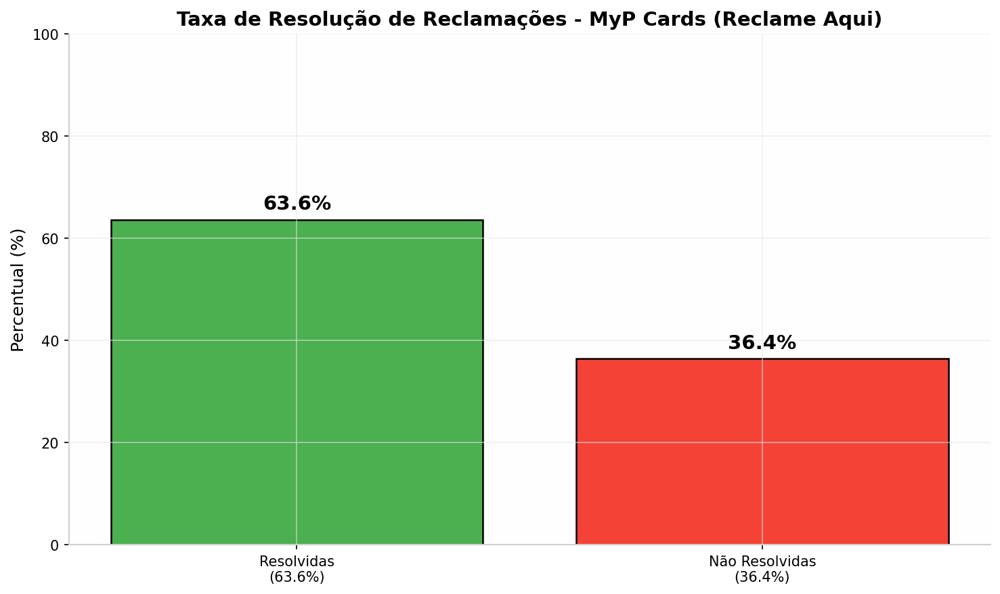
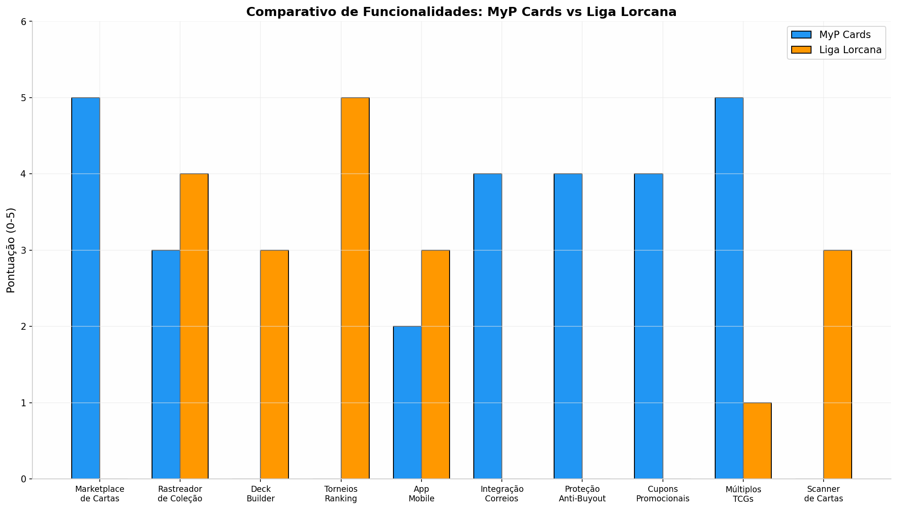

# Pesquisa de Mercado: Análise Técnica e Estratégica das Plataformas MyP Cards e Liga Lorcana no Ecossistema de Trading Card Games do Brasil

## Resumo Executivo

O mercado de Trading Card Games (TCGs) no Brasil experimentou um crescimento notável nos últimos anos, impulsionado pela valorização de cartas como ativos colecionáveis e pela expansão de comunidades de jogadores. Nesse cenário, plataformas digitais como o **MyP Cards** e a **Liga Lorcana** emergem como atores principais, cada uma com abordagens distintas para atender às necessidades de colecionadores, jogadores e lojistas. O MyP Cards consolidou-se como o **maior marketplace especializado em card games do Brasil**, com mais de **100 mil usuários cadastrados**, **39 mil produtos** e aproximadamente **3 mil negociações semanais**, cobrindo 19 diferentes TCGs, incluindo Magic: The Gathering, Pokémon, Yu-Gi-Oh!, One Piece e Lorcana [^1^]. A plataforma adota um modelo de comissão decrescente que varia de **7% a 1%** sobre as vendas, dependendo do volume mensal do vendedor, e oferece funcionalidades como integração com os Correios, proteção anti-buyout e sistema de cupons promocionais para lojistas certificados [^11^][^13^]. Por outro lado, a Liga Lorcana posiciona-se como uma **plataforma especializada no ecossistema Disney Lorcana**, focada em organizar torneios, manter rankings de jogadores, rastrear coleções e promover a cena competitiva do jogo no Brasil, operando em parceria com a Copag, distribuidora oficial da Ravensburger no país [^36^][^55^].

A análise aprofundada revela que, embora o MyP Cards tenha construído uma infraestrutura robusta para comércio de cartas, enfrenta desafios significativos relacionados à **logística de envio**, **tempo de resposta ao consumidor** e **políticas de reembolso** que geram frustração entre usuários, como evidenciado por sua nota média de **6.27/10** no Reclame Aqui, com apenas **63.6% das reclamações resolvidas** [^7^]. A Liga Lorcana, por sua vez, sofre com a **fragmentação de informações** e a **dependência de sites externos** para funcionalidades complementares, uma vez que seu site principal está protegido por Cloudflare e informações detalhadas sobre todas as suas funcionalidades são dispersas em múltiplos domínios e canais [^2^]. O mercado brasileiro de TCGs apresenta oportunidades substanciais para novas plataformas que consigam integrar as capacidades de marketplace do MyP Cards com as ferramentas de gestão de comunidade e competitivo da Liga Lorcana, enquanto resolvem problemas críticos de usabilidade, suporte ao cliente e logística que afetam ambas as plataformas atuais. O crescimento de **130% nas vendas de cartas usadas** entre 2024 e 2025 [^31^], aliado ao fato de o Brasil ser o maior mercado da América Latina para produtos TCG [^29^], indica um terreno fértil para inovações que enderecem as lacunas identificadas nesta pesquisa.

---

## 1. MyP Cards: Arquitetura, Funcionalidades e Modelo de Negócio

### 1.1 Visão Geral da Plataforma

O MyP Cards estabeleceu-se como a principal referência em marketplace de card games no Brasil desde sua criação em **2017**, posicionando-se como uma plataforma segura e prática para colecionar, comprar e vender cartas de diversos jogos [^1^][^15^]. A plataforma opera como um **marketplace multi-vendedor**, onde usuários individuais, vendedores certificados e lojistas podem cadastrar seus produtos, definir preços e negociar diretamente com compradores, enquanto o MyP Cards atua como intermediário responsável pelo processamento de pagamentos, mediação de disputas e garantia de segurança nas transações [^9^]. O modelo de negócio é baseado em **comissões sobre vendas efetivadas**, sem custos fixos ou mensalidades para usuários padrão, o que reduz a barreira de entrada para novos vendedores e permite que qualquer pessoa comece a vender suas cartas sem investimento inicial [^13^]. A plataforma cobre um espectro amplo de card games, incluindo títulos consolidados como **Magic: The Gathering, Pokémon TCG, Yu-Gi-Oh!** e lançamentos mais recentes como **Disney Lorcana, One Piece Card Game e Riftbound**, totalizando **19 jogos diferentes** [^1^].

A estrutura operacional do MyP Cards foi projetada para minimizar os riscos tanto para compradores quanto para vendedores. O comprador realiza o pagamento diretamente à plataforma, que retém o valor até que o comprador confirme o recebimento do pedido em boas condições, somente então liberando os créditos ao vendedor [^9^]. Esse sistema de **pagamento retido (escrow)** é fundamental para a confiança no marketplace, pois protege o comprador de fraudes e o vendedor de calote. A plataforma também oferece múltiplas formas de pagamento, incluindo **PIX, boleto bancário, cartão de crédito e depósito no Bradesco**, embora algumas modalidades incorram em custos adicionais de transação que são repassados ao comprador [^70^]. Para vendedores, o ciclo de vendas é estruturado em etapas claras: cadastro de cartas, aguardo de vendas, preparação e envio do pedido, acompanhamento da entrega, confirmação de recebimento pelo comprador, e finalmente o recebimento dos créditos que podem ser sacados para uma conta bancária mediante o pagamento de uma **taxa de saque de R$ 9,90** para usuários padrão [^70^].

### 1.2 Funcionalidades Core e Ferramentas para Vendedores

O ecossistema do MyP Cards foi construído com um conjunto robusto de funcionalidades projetadas para facilitar a vida tanto de vendedores casuais quanto de lojistas profissionais. A plataforma oferece ferramentas de gestão de estoque, sistemas de proteção contra compras massivas, integrações logísticas e um programa de benefícios escalonado que recompensa vendedores de alto desempenho.

#### 1.2.1 Sistema de Cadastro e Gestão de Estoque

O processo de cadastro de cartas no MyP Cards foi otimizado para ser intuitivo, permitindo que vendedores adicionem produtos informando o jogo, edição, idioma, condição e preço [^9^]. Uma funcionalidade particularmente útil é o **"Cadastro Múltiplo"**, que possibilita a adição de várias cartas simultaneamente, agilizando o processo para vendedores com grandes inventários [^9^]. O sistema também permite a **importação de cartas de outros sites**, facilitando a migração de vendedores que já operam em outras plataformas, desde que o lote seja superior a 1.000 itens [^11^]. Cada carta cadastrada recebe uma página de produto padronizada, onde são exibidas informações detalhadas sobre a edição, raridade, número da carta e imagem ilustrativa, embora a plataforma deixe claro que **a imagem é meramente ilustrativa** e o comprador deve se atentar às especificações do vendedor [^41^]. Para manter a qualidade do marketplace, o MyP Cards impõe rigorosas diretrizes de cadastro, exigindo que vendedores classifiquem corretamente o estado de conservação das cartas (Near Mint, Played, Heavily Played, Damaged) e cadastrem apenas produtos que realmente possuem em estoque, sob pena de punições que podem levar à suspensão da conta [^43^].

#### 1.2.2 Tipos de Vendedores e Níveis de Acesso

A plataforma estrutura seus vendedores em três categorias distintas, cada uma com permissões e funcionalidades específicas:

| Funcionalidade | Usuário Padrão | Certificado | Lojista |
|---|---|---|---|
| Mensalidade | Isento | Isento | Isento |
| Taxa de Comissão | 7% a 1% [^11^] | 7% a 1% [^11^] | 7% a 1% [^11^] |
| Vender Cards Avulsos, Decks e Sets | Sim | Sim | Sim |
| Importação de Cartas (>1000) | Sim | Sim | Sim |
| Taxa de Saque | **R$ 9,90** [^70^] | **R$ 4,90** [^11^] | **R$ 1,90** [^11^] |
| Gerar Cupom Promocional | Não | **Sim** [^11^] | **Sim** [^11^] |
| Venda de Outros Produtos (além de cards) | Não | **Sim** [^11^] | **Sim** [^11^] |
| Atualizador de Preços em Lote | Não | **Sim** [^11^] | **Sim** [^11^] |
| Integração com Correios | Não | **Sim** [^11^] | **Sim** [^11^] |
| Proteção Anti-Buyout | Não | **Sim** [^11^] | **Sim** [^11^] |
| Cadastro de Promoção em Lote | Não | **Sim** [^11^] | **Sim** [^11^] |
| Redirecionamento de Domínio Próprio | Não | Não | **Sim** [^11^] |
| Ponto de Venda (PDV) na Loja Física | Não | Não | **Sim** [^11^] |
| Capa da Loja e Banners Personalizados | Não | Não | **Sim** [^11^] |

Para se tornar um **vendedor certificado**, é necessário manter um estoque mínimo de aproximadamente 1.000 itens diferentes, uma média mensal de 10 vendas nos últimos 3 meses e uma avaliação mínima de 4.7 estrelas [^13^]. Já o status de **lojista** exige CNPJ ativo com CNAE coerente à comercialização de produtos geek, além de manter estoque consistente, regularidade de vendas e excelência nas avaliações após 3 meses na plataforma [^11^].

#### 1.2.3 Integração Logística e Proteção ao Vendedor

Uma das funcionalidades mais valorizadas por vendedores profissionais é a **integração com os Correios**, disponível para certificados e lojistas que atendam a critérios de reputação e volume de vendas [^13^]. Essa integração automatiza a geração de etiquetas de envio, inserção automática de códigos de rastreio e declaração de conteúdo, além de permitir que o frete seja pago diretamente pelo comprador ao MyP Cards, que repassa aos Correios, eliminando a necessidade de fluxo de caixa para despesas postais pelo vendedor [^13^]. Para proteger vendedores de compras massivas que poderiam esgotar seu estoque de forma predatória, a plataforma oferece a **"Proteção Contra Buyout"**, que permite configurar limites de venda por dia (24h) e por pedido para cada item, bloqueando automaticamente vendas que excedam esses limites [^13^]. Outra ferramenta exclusiva para vendedores certificados e lojistas é a função de **"Transferência entre usuários"**, que permite realizar ajustes financeiros de até R$ 50,00 em pedidos, como devoluções parciais por itens faltantes ou diferenças de qualidade, sem necessidade de abrir disputas formais [^13^].

### 1.3 Modelo de Comissões e Taxas

O modelo financeiro do MyP Cards é projetado para ser atrativo tanto para vendedores iniciantes quanto para profissionais de alto volume, utilizando um sistema de **comissão decrescente** que recompensa a fidelidade e o crescimento do vendedor na plataforma.

#### 1.3.1 Estrutura da Comissão Decrescente

A comissão padrão do MyP Cards é de **7% sobre o valor das vendas efetivadas**, sem qualquer custo fixo ou mensalidade [^13^]. No entanto, à medida que o vendedor atinge determinados patamares de valor total de pedidos pagos no mês vigente, a comissão decresce progressivamente, podendo chegar a **1%** para vendedores que ultrapassem R$ 80.000,00 em vendas mensais [^13^]. O sistema funciona de forma escalonada: quando o vendedor atinge uma nova faixa, a comissão reduzida passa a valer para todos os pedidos subsequentes dentro do mesmo mês calendário. Ao início de cada novo mês, a comissão retorna ao patamar de 7% e o ciclo recomeça [^13^][^14^].

| Faixa de Pedidos Pagos (R$) | Comissão Aplicada |
|---|---|
| Padrão | **7,00%** |
| A partir de R$ 10.000,00 | **6,00%** |
| A partir de R$ 20.000,00 | **5,00%** |
| A partir de R$ 30.000,00 | **4,00%** |
| A partir de R$ 40.000,00 | **3,00%** |
| A partir de R$ 50.000,00 | **2,50%** |
| A partir de R$ 60.000,00 | **2,00%** |
| A partir de R$ 70.000,00 | **1,50%** |
| A partir de R$ 80.000,00 | **1,00%** |

Essa estrutura de comissão decrescente é um dos diferenciais competitivos do MyP Cards em comparação com outras plataformas. Enquanto o **Liga Pokémon** cobra taxas que variam entre **10% e 15%** sobre vendas, e o **Mercado Livre** pode chegar a **16%** em algumas categorias, o MyP Cards oferece condições potencialmente mais vantajosas para vendedores de alto volume [^50^]. O **Cardmarket**, principal marketplace europeu, cobra **5%** de comissão, o que o torna competitivo, mas a inviabilidade logística para vendedores brasileiros limita sua atratividade no mercado nacional [^50^].

#### 1.3.2 Taxas de Saque e Custos Operacionais

Além da comissão sobre vendas, o MyP Cards cobra uma **taxa de saque** para transferir os créditos acumulados para a conta bancária do vendedor. Essa taxa varia conforme o tipo de conta: **R$ 9,90 para usuários padrão, R$ 4,90 para vendedores certificados e R$ 1,90 para lojistas** [^11^][^70^]. O prazo de processamento do saque é de **2 dias úteis**, e os dados bancários devem obrigatoriamente pertencer ao usuário cadastrado no sistema, medida de segurança contra lavagem de dinheiro e fraudes [^70^]. Vendedores frequentes costumam acumular créditos ao longo do mês para realizar um único saque, minimizando o impacto da taxa fixa sobre seu faturamento [^13^]. É importante notar que o sistema de comissão decrescente exclui o valor do frete e vendas realizadas em balcão (PDV) do cálculo do volume mensal, focando exclusivamente no valor dos produtos vendidos [^13^].

### 1.4 Análise de Reclamações e Pontos de Dor

A análise das reclamações do MyP Cards no portal Reclame Aqui e em fóruns de comunidade revela padrões recorrentes de insatisfação que apontam para oportunidades claras de melhoria na plataforma. Com uma nota média de **6.27/10** e apenas **63.6% das reclamações resolvidas**, há espaço significativo para aprimoramento na experiência do usuário [^7^].

#### 1.4.1 Reclamações no Reclame Aqui: Padrões e Recorrências

A página do MyP Cards no Reclame Aqui registra **20 reclamações** no total, com a empresa respondendo 100% delas, mas com uma taxa de resolução que deixa um terço dos consumidores insatisfeitos [^7^]. A nota de reputação da empresa é classificada como "Bom" (**7.1/10** nos últimos 6 meses), mas o tempo médio de resposta de **14 dias e 1 hora** é um indicativo claro de lentidão no atendimento ao cliente que pode amplificar a frustração dos usuários [^7^]. As reclamações avaliadas revelam que **63.6% dos consumidores voltariam a fazer negócio** com a plataforma, sugerindo que, apesar dos problemas, a utilidade do marketplace mantém os usuários leais, mas essa lealdade é frágil e depende da resolução rápida de conflitos [^7^].

#### 1.4.2 Problemas Críticos: Envio, Logística e Prazos

O principal ponto de dor relatado por compradores no MyP Cards está relacionado à **logística de envio e aos prazos de entrega**. Vários relatos no Reddit e no Reclame Aqui mencionam atrasos significativos nos envios, muitas vezes atribuídos às dificuldades estruturais dos Correios brasileiros, mas também à falta de agilidade por parte de alguns vendedores em postar os pedidos [^45^][^7^]. O MyP Cards estabelece um prazo recomendado de **7 dias para envio** após a confirmação do pagamento, e implementa um sistema de alertas automáticos que notifica vendedores inativos via plataforma e WhatsApp, cancelando o pedido e punindo o vendedor caso não haja resposta em até 10 dias [^61^]. No entanto, esses mecanismos nem sempre são suficientes para prevenir a frustração do comprador, que pode ficar dias aguardando um envio sem comunicação clara sobre o status do pedido. A dependência dos Correios como principal modalidade de envio é um desafio compartilhado por todo o e-commerce brasileiro, mas em um marketplace de cartas, onde os produtos são pequenos e de alto valor relativo, a falta de opções alternativas de envio (como transportadoras privadas com custos competitivos para pacotes leves) representa uma limitação significativa.

#### 1.4.3 Críticas à Interface, Usabilidade e Suporte ao Cliente

A interface do usuário do MyP Cards, embora funcional, é frequentemente descrita como **datada e pouco intuitiva** para novos usuários, especialmente quando comparada a plataformas mais modernas como a Liga Pokémon [^50^]. A navegação pode ser confusa, com filtros de busca que nem sempre retornam resultados precisos e uma estética visual que não acompanha os padrões contemporâneos de design de e-commerce. No entanto, o problema mais grave identificado é a **falta de suporte efetivo da plataforma na mediação de disputas entre compradores e vendedores**. Uma reclamação no Reclame Aqui cita explicitamente a "falta de suporte da plataforma na mediação de problemas entre comprador e vendedor, resultando em má avaliação para o vendedor" [^7^], sugerindo que o sistema de resolução de conflitos pode ser tendencioso ou ineficiente. Outra reclamação recente menciona um **pedido cancelado pelo lojista após vários dias**, gerando prejuízo ao comprador com custos de frete e cupons perdidos, e outra critica a política de reembolso que converte pagamentos via PIX em créditos na plataforma em vez de devolução direta do dinheiro, o que pode ser interpretado como descumprimento do Código de Defesa do Consumidor [^7^].

---

## 2. Liga Lorcana: Ecossistema, Funcionalidades e Cenário Competitivo

### 2.1 Visão Geral da Plataforma

A Liga Lorcana é uma plataforma brasileira especializada no ecossistema do **Disney Lorcana Trading Card Game (TCG)**, desenvolvido pela Ravensburger e distribuído oficialmente no Brasil pela Copag [^51^]. Diferente do MyP Cards, que é um marketplace genérico para múltiplos TCGs, a Liga Lorcana adota uma abordagem **verticalizada e focada**, concentrando-se em fornecer ferramentas para gestão de coleções, organização de torneios, manutenção de rankings competitivos e fomento da comunidade de jogadores de Lorcana no Brasil. A plataforma opera em conjunto com outros domínios relacionados, como o **circuitoligalorcana.com.br**, que gerencia o circuito competitivo oficial, e o site da Copag, que funciona como hub de eventos e informações oficiais do jogo [^36^][^37^]. Essa fragmentação de presença digital, embora funcional, pode criar confusão para usuários que precisam navegar entre múltiplos sites para acessar todas as funcionalidades do ecossistema.

O crescimento explosivo do Disney Lorcana desde seu lançamento em 2023 criou uma demanda imediata por infraestrutura de suporte no Brasil, e a Liga Lorcana posicionou-se para preencher essa lacuna [^51^]. O jogo atrai não apenas jogadores tradicionais de TCG, mas também colecionadores de Disney, fãs casuais e investidores, criando uma comunidade diversificada que exige ferramentas específicas para gestão de coleções e participação em eventos [^51^]. A plataforma oferece funcionalidades como rastreamento de coleções, deck builder, scanner de cartas e, mais importante, um sistema abrangente de gerenciamento de torneios e rankings que alimenta o cenário competitivo brasileiro [^56^][^57^]. O sucesso da plataforma está intrinsecamente ligado ao crescimento do Lorcana no país, e eventos como o **Disney Lorcana Challenge em São Paulo**, que reuniu mais de **400 participantes** em abril de 2026, demonstram o potencial e a escala da comunidade que a plataforma serve [^55^].

### 2.2 Funcionalidades e Ferramentas

O ecossistema da Liga Lorcana foi desenvolvido para atender às necessidades específicas de jogadores e organizadores de eventos de Disney Lorcana, com ferramentas que vão desde o gerenciamento pessoal de coleções até a estruturação de circuitos competitivos nacionais.

#### 2.2.1 Sistema de Torneios e Rankings

O núcleo competitivo da Liga Lorcana é seu sistema de **torneios e rankings**, gerenciado principalmente através do domínio circuitoligalorcana.com.br [^36^]. A plataforma suporta múltiplos formatos de eventos, incluindo **Ligas de Loja (League Play)**, torneios locais com sistema suíço (Swiss Rounds), campeonatos regionais e nacionais, além de eventos especiais como pré-lançamentos e drafts [^69^]. O sistema de ranking atribui pontos baseados na participação e desempenho em eventos oficiais: cada jornada disputada rende pontos, com vitórias valendo mais que derrotas [^68^]. Por exemplo, em uma liga típica, a participação garante 2 pontos, cada vitória adiciona 1 ponto, e trazer um jogador novo pode render 2 pontos extras como incentivo ao crescimento da comunidade [^68^]. Ao final de cada temporada (geralmente com 12 semanas), os jogadores com mais pontos no ranking recebem premiações que incluem boosters, cartas promocionais exclusivas e pins temáticos [^68^].

O circuito competitivo é estruturado em etapas que culminam em uma **Final Nacional**. Os **8 melhores jogadores do ranking** de cada formato são classificados para um Top 8 de eliminatória, onde o campeão pode ganhar vagas para competições internacionais [^36^]. A plataforma também integra-se com ferramentas internacionais como o **EloQuest**, que rastreia resultados de torneios e alimenta rankings comunitários baseados no sistema ELO, permitindo que jogadores brasileiros comparem seu desempenho com o cenário global [^63^]. Essa integração com ferramentas de terceiros amplia a funcionalidade da plataforma, mas também cria dependências que podem afetar a consistência da experiência do usuário.

#### 2.2.2 Rastreador de Coleções e Deck Builder

Para colecionadores e jogadores casuais, a Liga Lorcana oferece um **rastreador de coleções digital** que permite cadastrar as cartas possuídas, acompanhar o progresso de completar sets e visualizar o valor estimado da coleção [^56^]. Essa funcionalidade é complementada por um **deck builder** integrado, onde os usuários podem montar e salvar seus baralhos, testar combinações de cartas e compartilhar suas criações com a comunidade [^77^][^81^]. A plataforma também oferece ou integra-se com **aplicativos de scanner de cartas** que utilizam a câmera do celular para identificar e adicionar cartas à coleção automaticamente, agilizando significativamente o processo de catalogação [^56^][^58^]. Essas ferramentas são essenciais para o engajamento da comunidade, pois permitem que jogadores teoricizem sobre estratégias, compartilhem builds populares e se preparem para eventos competitivos de forma mais eficiente.

#### 2.2.3 Integração com Lojas e Organizadores de Eventos

A Liga Lorcana funciona como um **hub de conexão entre jogadores, lojas parceiras e organizadores de eventos**. Lojas especializadas podem se cadastrar na plataforma para anunciar seus eventos locais, gerenciar inscrições e reportar resultados que alimentam o ranking nacional [^69^]. Essa integração é fundamental para a descentralização do cenário competitivo, permitindo que comunidades locais em todo o Brasil contribuam para o ranking nacional e tenham acesso a premiações oficiais. A plataforma também serve como canal de comunicação oficial para anúncios de novas coleções, mudanças de regras e calendários de eventos, funcionando como uma fonte centralizada de informações para a comunidade brasileira [^71^]. No entanto, a plataforma **lorcana.com.br** que poderia servir como hub de eventos mostrou **"0 eventos cadastrados"** e "0 com inscrições abertas" em momentos de pesquisa, sugerindo problemas de manutenção ou adoção por parte dos organizadores [^71^].

### 2.3 Ecossistema Disney Lorcana no Brasil

O Disney Lorcana chegou oficialmente ao Brasil através da **Copag**, que se estabeleceu como a distribuidora oficial da Ravensburger no país [^51^]. Essa parceria é crucial para a legitimidade e sustentabilidade do jogo no mercado brasileiro, pois garante o fornecimento de produtos originais, organização de eventos oficiais e suporte à comunidade de jogadores. A Copag não apenas distribui os produtos, mas também ativamente **fomenta o cenário competitivo** através da organização de grandes eventos como o Disney Lorcana Challenge, que atrai centenas de participantes e serve como ponto de encontro para a comunidade nacional [^55^].

O ecossistema é composto por múltiplos atores: a Ravensburger (desenvolvedora global), a Copag (distribuidora nacional), a Liga Lorcana (plataforma de gestão de comunidade e competitivo), lojas parceiras (que hospedam eventos locais) e a própria comunidade de jogadores e colecionadores. O sucesso do Lorcana no Brasil depende da sinergia entre esses atores. A **Copag tem investido em criar uma infraestrutura de eventos robusta**, com diferentes níveis de competição que vão desde ligas casuais em lojas locais até campeonatos nacionais de grande porte [^69^]. Essa estratégia de crescimento em camadas é projetada para criar um funtil que introduz novos jogadores de forma acessível e gradualmente os prepara para o cenário competitivo de alto nível, espelhando modelos bem-sucedidos de outros TCGs estabelecidos como Pokémon e Magic [^29^].

### 2.4 Análise de Críticas e Oportunidades de Melhoria

Apesar de suas funcionalidades robustas, o ecossistema da Liga Lorcana apresenta várias áreas onde melhorias significativas poderiam beneficiar a comunidade de jogadores.

#### 2.4.1 Fragmentação de Informações e Presença Digital

A presença digital da Liga Lorcana está **fragmentada em múltiplos domínios e plataformas**, o que pode confundir usuários. Informações sobre torneios, rankings, regras e notícias estão distribuídas entre ligalorcana.com.br, circuitoligalorcana.com.br, copag.com.br, eloquest.ink e diversos grupos de redes sociais [^36^][^63^]. Ambos os sites principais da Liga Lorcana estão protegidos por **Cloudflare**, o que impede acesso automatizado e pode dificultar a indexação por mecanismos de busca, reduzindo a visibilidade orgânica da plataforma [^2^]. Essa dispersão de conteúdo cria uma experiência do usuário inconsistente e exige que jogadores naveguem entre múltiplas fontes para obter informações completas, o que pode desmotivar a participação, especialmente de novos membros da comunidade.

#### 2.4.2 Limitações Técnicas e Ausência de Funcionalidades

Embora a Liga Lorcana ofereça um conjunto sólido de ferramentas para o cenário competitivo, existem funcionalidades que poderiam enriquecer significativamente a experiência dos usuários. A ausência de um **marketplace integrado** para compra e venda de cartas é uma das lacunas mais evidentes, obrigando jogadores a recorrerem a plataformas como o MyP Cards ou grupos de Facebook para negociar cards específicos para seus decks. A integração de um sistema de troca ou venda P2P diretamente na plataforma criaria uma experiência mais completa e retida os usuários por mais tempo. Outra limitação é a **dependência de ferramentas de terceiros** para funcionalidades como scanner de cartas e rankings ELO, o que cria dependências e pode resultar em inconsistências de dados [^56^][^63^]. O desenvolvimento de soluções proprietárias ou parcerias estratégicas mais profundas poderia resolver essas fragilidades.

#### 2.4.3 Necessidade de Maior Integração com Outras Plataformas

A Liga Lorcana opera de forma relativamente isolada em relação a outras plataformas do ecossistema TCG brasileiro. Uma integração mais profunda com o **MyP Cards** ou outras plataformas de marketplace poderia beneficiar ambas as partes: a Liga Lorcana ganharia uma funcionalidade de comércio, enquanto o MyP Cards teria acesso a uma comunidade altamente engajada de jogadores de Lorcana. Similarmente, a integração com plataformas de **streaming e cobertura de eventos** poderia aumentar a visibilidade do cenário competitivo brasileiro, atraindo patrocinadores e novos jogadores. A falta de uma **API pública** que permita a desenvolvedores terceiros criar aplicativos e ferramentas que se integrem com os dados da Liga Lorcana limita a inovação e o crescimento orgânico do ecossistema ao redor da plataforma.

---

## 3. Análise Comparativa e Benchmarking de Mercado

### 3.1 MyP Cards vs. Liga Lorcana: Comparativo Técnico

As plataformas MyP Cards e Liga Lorcana, embora operem no mesmo universo de card games, adotam abordagens fundamentalmente diferentes que as posicionam para públicos e necessidades distintas. O MyP Cards é uma solução **horizontal** de e-commerce, projetada para maximizar o volume de transações em múltiplos TCGs, enquanto a Liga Lorcana é uma solução **vertical**, focada em criar valor através da gestão de comunidade e competição para um único jogo.

| Critério de Comparação | MyP Cards | Liga Lorcana |
|---|---|---|
| **Modelo de Negócio** | Marketplace multi-vendedor (e-commerce) | Plataforma de comunidade e gestão de torneios |
| **Foco Principal** | Compra e venda de cartas e produtos TCG | Organização de eventos, rankings e coleções |
| **Cobertura de TCGs** | **19 jogos** (Magic, Pokémon, Yu-Gi-Oh!, Lorcana, etc.) [^1^] | **Exclusivo Disney Lorcana** |
| **Fonte de Receita** | Comissão de 7% a 1% sobre vendas [^13^] | Modelo de receita não transparente |
| **Funcionalidade Core** | Gestão de estoque, processamento de pagamentos, escrow | Sistema de torneios, rankings, deck builder |
| **Público-Alvo Primário** | Colecionadores, vendedores, lojistas | Jogadores competitivos, colecionadores de Lorcana |
| **Integração Logística** | Integração com Correios (para certificados/lojistas) [^13^] | Sem integração logística |
| **App Mobile** | **Não possui** app nativo | Integra-se com apps de terceiros (scanner, ELO) |
| **Presença no Reclame Aqui** | Nota 6.27/10, 63.6% resolução [^7^] | Sem presença significativa |

O comparativo de funcionalidades revela um cenário de **complementaridade** entre as plataformas. O MyP Cards domina nas funcionalidades de e-commerce (marketplace, integração com Correios, proteção anti-buyout, cupons), enquanto a Liga Lorcana é superior em ferramentas de engajamento comunitário e competitivo (torneios, rankings, deck builder, scanner de cartas). Nenhuma das duas plataformas oferece uma solução completa e integrada que atenda simultaneamente às necessidades de comércio e de gestão de comunidade competitiva.

### 3.2 Concorrentes e Alternativas no Mercado Brasileiro

O mercado de plataformas para TCGs no Brasil é composto por uma variedade de atores, cada um com seu próprio modelo de negócio e foco. A análise desses concorrentes é essencial para entender o posicionamento do MyP Cards e da Liga Lorcana e identificar oportunidades de diferenciação.

#### 3.2.1 Liga Pokémon: Funcionalidades e Modelo

A **Liga Pokémon** é frequentemente citada como o principal concorrente do MyP Cards no mercado brasileiro de TCGs, especialmente no segmento Pokémon [^49^]. A plataforma funciona como um **agregador de lojas**, mostrando todas as lojas cadastradas que possuem uma carta específica, com comparação de preços, quantidade disponível e condição [^49^]. A grande vantagem da Liga Pokémon é a exibição de **preços praticados no Brasil em reais**, com comparação entre dezenas de vendedores, além de um histórico de variação de preços [^49^]. A plataforma também oferece sistemas de **leilão e trocas** entre usuários, funcionalidades que o MyP Cards não possui [^49^]. No entanto, a interface é descrita como "um pouco datada" e a plataforma cobra uma **taxa de serviço de R$ 0,99 por compra** no marketplace, além de comissões que variam entre **10% e 15%** sobre vendas, significativamente mais altas que as do MyP Cards para vendedores de baixo e médio volume [^50^].

#### 3.2.2 Cardmarket e TCGPlayer: Panorama Internacional

No cenário internacional, o **TCGPlayer** é a maior referência global de precificação e marketplace de card games [^49^]. Seu "Market Price" é calculado com base em transações reais, não em anúncios, o que o torna uma referência confiável para o valor de mercado das cartas [^49^]. A plataforma possui um app com scanner de cartas e indicadores de volatilidade de preço, funcionalidades avançadas que nenhuma plataforma brasileira oferece de forma nativa. A principal limitação para usuários brasileiros é que os preços são em dólar e o **frete internacional pode inviabilizar compras de cartas de baixo valor** [^49^]. O **Cardmarket** é o maior marketplace de TCG da Europa, com mais de 500 milhões de ofertas, cobrindo múltiplos TCGs com uma comissão de apenas **5%** [^49^]. Assim como o TCGPlayer, a compra direta do Brasil é inviável para a maioria dos casos devido ao frete internacional e conversão de moeda [^49^].

#### 3.2.3 Mercado Livre, Shopee e OLX: Genéricos vs. Especializados

Plataformas de e-commerce genéricas como **Mercado Livre, Shopee e OLX** também competem pelo mercado de cartas TCG, mas de forma indireta. Essas plataformas oferecem maior visibilidade e tráfego, mas carecem das funcionalidades especializadas que colecionadores e jogadores valorizam, como filtros por edição, raridade, condição da carta e integração com bases de dados de TCGs. Além disso, as taxas do Mercado Livre podem chegar a **16%**, superiores às do MyP Cards e muito acima das do Cardmarket [^50^]. A OLX destacou-se em um levantamento por registrar um crescimento de **130% nas vendas de cards usados** entre janeiro e setembro de 2025, com Pokémon respondendo por 92% das vendas totais de cartas colecionáveis na plataforma [^31^]. Esse dado demonstra a força da demanda, mas também evidencia que grande parte das transações ocorre em ambientes menos seguros e sem as proteções especializadas de plataformas como o MyP Cards.

### 3.3 Análise SWOT: MyP Cards

| | **Positivo** | **Negativo** |
|---|---|---|
| **Interno** | **Pontos Fortes:** - Maior marketplace especializado de TCGs do Brasil [^1^] - Comissão decrescente competitiva (até 1%) [^13^] - Sistema escrow de segurança em transações [^9^] - Integração com Correios para vendedores certificados [^13^] - Proteção anti-buyout [^13^] - Suporte a 19 TCGs diferentes [^1^] | **Pontos Fracos:** - Interface datada e pouco intuitiva [^50^] - Nota baixa no Reclame Aqui (6.27/10) [^7^] - Tempo médio de resposta de 14 dias no suporte [^7^] - Taxa de saque de R$ 9,90 para usuários padrão [^70^] - Ausência de app mobile nativo - Dependência exclusiva dos Correios para envio |
| **Externo** | **Oportunidades:** - Crescimento de 130% no mercado de cartas usadas [^31^] - Brasil como maior mercado LATAM para TCGs [^29^] - Expansão para outros TCGs em crescimento (Lorcana, One Piece) - Parcerias com lojas físicas para modelo híbrido - Desenvolvimento de ferramentas de scanner e pricing | **Ameaças:** - Concorrência da Liga Pokémon (taxa fixa de R$ 0,99) [^49^] - Entrada de plataformas internacionais (Cardmarket, TCGPlayer) - Mercado Livre e Shopee com maior visibilidade - Instabilidade logística dos Correios brasileiros - Crescimento de grupos de Facebook/WhatsApp para vendas diretas |

### 3.4 Análise SWOT: Liga Lorcana

| | **Positivo** | **Negativo** |
|---|---|---|
| **Interno** | **Pontos Fortes:** - Foco exclusivo em Lorcana (especialização) - Sistema robusto de torneios e rankings [^36^] - Parceria oficial com Copag (distribuidora oficial) [^51^] - Deck builder e rastreador de coleções integrados - Apoio ao cenário competitivo nacional - Eventos de grande porte (400+ participantes) [^55^] | **Pontos Fracos:** - Presença digital fragmentada em múltiplos sites - Sites protegidos por Cloudflare (baixa indexação) [^2^] - Ausência de marketplace integrado para compra/venda de cartas - Dependência de ferramentas de terceiros [^56^][^63^] - Modelo de receita não transparente - Interface e UX que podem ser confusas para novos usuários |
| **Externo** | **Oportunidades:** - Crescimento explosivo do Disney Lorcana no Brasil [^55^] - Comunidade diversificada (jogadores, colecionadores, fãs Disney) [^51^] - Expansão do cenário competitivo com eventos da Copag [^69^] - Integração com plataformas de streaming - Desenvolvimento de API pública para terceiros - Parceria com marketplaces (MyP Cards) para funcionalidade de comércio | **Ameaças:** - Dependência do sucesso comercial do Lorcana - Concorrência de outras plataformas de gestão de torneios - Fragmentação da comunidade em múltiplos grupos e canais - Mudanças na política da Ravensburger/Copag - Risco de perder usuários para plataformas mais integradas - Crescimento de alternativas internacionais (EloQuest, etc.) [^63^] |

---

## 4. Levantamento de Reclamações e Feedback da Comunidade

### 4.1 Reclamações do MyP Cards: Análise Detalhada

A análise das reclamações do MyP Cards revela padrões claros de insatisfação que, se não endereçados, podem comprometer a posição de liderança da plataforma no mercado brasileiro.

#### 4.1.1 Problemas com Vendedores e Qualidade dos Produtos

Uma das categorias mais recorrentes de reclamações envolve **disputas sobre a qualidade e autenticidade das cartas recebidas**. O MyP Cards deixa claro em seu FAQ que **"a divergência quanto à qualidade das cartas é o maior motivo de disputas atualmente na plataforma"** [^43^]. O sistema de classificação de condição (NM, PL, HP, DM) é subjetivo, e vendedores inexpertos ou mal-intencionados podem classificar cartas de forma otimista. Embora a plataforma não realize a classificação da qualidade em disputas, deixando a resolução por conta da negociação entre as partes [^43^], essa política pode frustrar compradores que esperam uma mediação mais ativa. Outro problema mencionado é a **venda de produtos falsificados**, que, embora a plataforma ameace com banimento e medidas legais, ainda ocorre e gera desconfiança [^43^].

#### 4.1.2 Dificuldades com Reembolsos e Cancelamentos

A política de reembolso do MyP Cards é uma fonte significativa de críticas. Uma reclamação no Reclame Aqui destaca a prática de **converter reembolsos de pagamentos via PIX em créditos na plataforma**, em vez de devolver o dinheiro diretamente ao comprador [^7^]. Essa política pode ser vista como uma violação do direito do consumidor ao reembolso integral e imediato em caso de cancelamento, conforme previsto no Código de Defesa do Consumidor. Outra reclamação frequente envolve **pedidos cancelados por vendedores após longos períodos de espera**, gerando frustração e prejuízos ao comprador que já havia separado capital e, em alguns casos, pago por frete ou utilizado cupons de desconto que não são restituídos [^7^]. Quando um pedido é cancelado pelo vendedor, uma nota 0 é atribuída automaticamente, afetando a reputação do vendedor, mas o comprador ainda precisa recomeçar todo o processo de busca e compra [^43^].

#### 4.1.3 Insatisfação com o Suporte e Tempo de Resposta

O suporte ao cliente é apontado como uma das maiores fragilidades do MyP Cards. Com um **tempo médio de resposta de 14 dias e 1 hora** no Reclame Aqui [^7^], a plataforma demonstra uma clara incapacidade de atender demandas de forma ágil. Em um mercado onde transações podem envolver valores significativos e a ansiedade de compradores e vendedores é alta, essa lentidão é inaceitável. Uma reclamação cita a **"falta de suporte da plataforma na mediação de problemas entre comprador e vendedor"**, sugerindo que quando o suporte finalmente intervém, a solução nem sempre é justa ou satisfatória para ambas as partes [^7^]. A plataforma orienta os usuários a resolverem conflitos diretamente, intervindo apenas quando acionada por uma das partes [^43^], mas essa abordagem passiva pode deixar usuários desamparados em situações de conflito.

### 4.2 Feedback sobre a Liga Lorcana: Comunidade e Fóruns

O feedback sobre a Liga Lorcana é menos estruturado que o do MyP Cards, concentrando-se principalmente em fóruns, grupos de redes sociais e discussões em eventos presenciais. No entanto, padrões claros de necessidade emergem dessas conversas.

#### 4.2.1 Necessidades de Melhoria na Experiência do Usuário

A comunidade frequentemente expressa a necessidade de uma **plataforma mais unificada e intuitiva**. A fragmentação atual, com informações dispersas em múltiplos sites, cria barreiras para novos jogadores que buscam entender como participar do cenário competitivo [^36^][^71^]. Há demanda por um **aplicativo mobile nativo** que integre todas as funcionalidades — rastreamento de coleção, deck builder, inscrição em torneios e consulta de rankings — em uma única interface fluida e responsiva. A dependência de apps de terceiros para funcionalidades como scanner de cartas é vista como uma solução temporária, não ideal [^56^][^58^].

#### 4.2.2 Demandas da Comunidade de Jogadores

Jogadores competitivos demandam **maior transparência no sistema de rankings**, com regras claras sobre como os pontos são calculados, critérios de desempate e processos de apelação. Há também uma forte demanda por **mais eventos em cidades do interior e regiões menos atendidas**, para democratizar o acesso ao cenário competitivo [^69^]. A comunidade também expressa interesse em funcionalidades de **social networking** integradas à plataforma, como perfis de jogador, histórico de partidas, estatísticas pessoais de desempenho e sistemas de mensagem para facilitar a organização de partidas casuais e a formação de grupos de treino.

#### 4.2.3 Expectativas para o Cenário Competitivo

Com o crescimento do Lorcana no Brasil, a comunidade espera que a Liga Lorcana evolua para oferecer uma **infraestrutura competitiva profissional**, com juízes certificados, cobertura em streaming de eventos principais, e um calendário de competições bem definido que permita aos jogadores planejar sua temporada [^55^]. A expectativa é que a plataforma se torne o **"ponto único de verdade"** para tudo relacionado ao Lorcana no Brasil, consolidando não apenas informações de torneios, mas também notícias, conteúdo educativo, e eventualmente um marketplace integrado.

---

## 5. Oportunidades de Melhoria e Inovação

### 5.1 Para o MyP Cards: Melhorias Imediatas

O MyP Cards tem uma base sólida de usuários e funcionalidades, mas precisa de melhorias estratégicas para manter sua liderança e elevar a satisfação do cliente.

#### 5.1.1 Modernização da Interface e Experiência do Usuário

A **reformulação completa da interface do usuário** é a melhoria mais urgente. Investir em um design moderno, responsivo e intuitivo, com navegação fluida e filtros de busca avançados e precisos, elevaria significativamente a experiência de compra e venda. A implementação de um **app mobile nativo para iOS e Android** permitiria que usuários gerenciassem suas pastas virtuais, respondessem mensagens e acompanhassem pedidos em tempo real, aumentando o engajamento e a conveniência.

#### 5.1.2 Implementação de Sistema de Reputação e Avaliações Mais Robusto

O sistema de avaliação atual pode ser aprimorado com a introdução de **avaliações multidimensionais**, onde compradores avaliem não apenas a experiência geral, mas aspectos específicos como velocidade de envio, qualidade da embalagem e precisão da descrição das cartas. Isso forneceria dados mais granulados para outros compradores e incentivariam vendedores a melhorarem em áreas específicas. A implementação de um **selo de "Vendedor Verificado"** com critérios rigorosos de autenticidade e qualidade poderia reduzir a incidência de produtos falsificados.

#### 5.1.3 Redução de Taxas e Criação de Programa de Fidelidade

A **redução da taxa de saque para usuários padrão**, atualmente em R$ 9,90, seria um forte incentivo para manter vendedores casuais na plataforma. A criação de um **programa de fidelidade** que recompense compradores frequentes com pontos, descontos exclusivos ou frete grátis poderia aumentar a recorrência de compras e a retenção de clientes. Para vendedores, além da comissão decrescente existente, a introdução de **benefícios não-financeiros**, como destaque em resultados de busca ou acesso antecipado a novas funcionalidades, poderia fortalecer o relacionamento.

### 5.2 Para a Liga Lorcana: Expansão e Integração

A Liga Lorcana tem um nicho forte e uma comunidade engajada, mas precisa expandir suas funcionalidades para se tornar uma plataforma completa.

#### 5.2.1 Desenvolvimento de Marketplace Integrado

A adição de um **marketplace para compra e venda de cartas de Lorcana** seria a melhoria mais impactante. Integrar essa funcionalidade diretamente na plataforma, permitindo que jogadores negociem cards para seus decks sem sair do ecossistema, criaria uma experiência de usuário completa e aumentaria significativamente o tempo de permanência dos usuários na plataforma. Esse marketplace poderia operar com um modelo de comissão similar ao do MyP Cards, criando uma nova fonte de receita.

#### 5.2.2 Criação de API para Integração com Outras Plataformas

O desenvolvimento de uma **API pública** permitiria que desenvolvedores terceiros criassem ferramentas complementares — apps de estatísticas, sites de análise de meta, bots para Discord — que se integrassem com os dados da Liga Lorcana. Isso aceleraria a inovação ao redor da plataforma e fortaleceria o ecossistema sem exigir investimento direto em desenvolvimento. A integração com o MyP Cards através de API, por exemplo, poderia permitir que coleções rastreadas na Liga Lorcana fossem facilmente listadas para venda no marketplace.

#### 5.2.3 Melhoria na Centralização de Informações

A **consolidação de todos os serviços e informações em um único domínio** é essencial para melhorar a experiência do usuário. A unificação dos sites ligalorcana.com.br e circuitoligalorcana.com.br, com uma navegação clara entre seções de coleções, torneios, rankings, notícias e (futuro) marketplace, eliminaria a confusão atual. A remoção ou configuração menos agressiva do Cloudflare permitiria melhor indexação por mecanismos de busca e acessibilidade.

### 5.3 Para o Mercado: Oportunidades de Nova Plataforma

A análise das lacunas do MyP Cards e da Liga Lorcana revela oportunidades significativas para uma nova plataforma que combine o melhor de ambos os mundos.

#### 5.3.1 Integração de Marketplace com Ferramentas de Torneio

Uma plataforma que ofereça tanto um **marketplace robusto** (com as funcionalidades de escrow, integração logística e proteção ao vendedor do MyP Cards) quanto **ferramentas de gestão de torneios e rankings** (como as da Liga Lorcana) teria um diferencial competitivo enorme. Jogadores poderiam comprar cards para seus decks, montá-los no deck builder, testá-los em torneios e vender cards que não utilizam — tudo em um único lugar.

#### 5.3.2 Foco na Experiência Mobile e em Tempo Real

Com o crescimento do acesso mobile, uma nova plataforma deveria ser **"mobile-first"**, com um app nativo que ofereça scanner de cartas por câmera, notificações push para torneios e mensagens, e uma interface otimizada para telas pequenas. A integração em **tempo real** de resultados de torneios, atualizações de rankings e mudanças de preços no marketplace criaria uma experiência dinâmica e engajadora.

#### 5.3.3 Implementação de Sistema de Autenticação e Grading de Cartas

A **falsificação de cartas** é uma preocupação crescente no mercado brasileiro [^26^]. Uma nova plataforma poderia se diferenciar oferecendo um **serviço integrado de autenticação e grading** (avaliação profissional de condição), parceiro com empresas como PSA, Beckett ou CGC. Vendedores poderiam enviar cartas de alto valor para grading antes da venda, aumentando a confiança do comprador e o valor do produto. Isso posicionaria a plataforma como um local seguro para transações de cartas premium.

---

## 6. Considerações Técnicas sobre Desenvolvimento

### 6.1 Arquitetura de Software e Escalabilidade

O desenvolvimento de uma plataforma para o mercado de TCGs exige uma arquitetura de software que suporte **alta concorrência, especialmente durante picos de demanda** como lançamentos de novas coleções ou grandes eventos. Uma abordagem baseada em **microserviços** seria ideal, permitindo que diferentes funcionalidades (marketplace, torneios, rankings, notificações) escalem independentemente conforme a demanda. O uso de **bancos de dados híbridos** (relacionais para transações e dados estruturados, NoSQL para catálogos de cartas e logs) pode otimizar performance. A implementação de **caching distribuído** (Redis, Memcached) é essencial para reduzir a carga em bancos de dados e melhorar a velocidade de consultas frequentes, como preços de cartas e classificações de ranking.

### 6.2 Banco de Dados e Gestão de Catálogos de Cartas

A gestão do catálogo de cartas é um dos desafios técnicos mais complexos. Cada jogo de TCG possui milhares de cartas, com múltiplas edições, raridades, idiomas, condições e variações (foil, promo, alternate art). O banco de dados deve ser capaz de armazenar e indexar essas informações de forma eficiente, permitindo buscas complexas e filtros combinados. A **normalização dos dados** é crucial: cada carta base deve ter um identificador único, com tabelas relacionadas para variações. A integração com **APIs oficiais** dos fabricantes de TCGs (quando disponíveis) ou com bases de dados comunitárias (como o Scryfall para Magic) pode automatizar a manutenção do catálogo. Para o Lorcana, a parceria com a Ravensburger ou Copag para acesso a dados oficiais seria um diferencial competitivo.

### 6.3 Integrações: Pagamento, Logística e APIs de Terceiros

A plataforma deve integrar-se com múltiplos **gateways de pagamento** (PIX, boleto, cartão de crédito) para oferecer flexibilidade aos usuários. A integração com **sistemas de logística** (Correios, transportadoras privadas) deve permitir o cálculo automático de frete, geração de etiquetas e rastreamento de encomendas. Para vendedores profissionais, a oferta de uma **API de gestão de estoque** permitiria a sincronização automática de inventários entre a plataforma e sistemas internos de ERP. A integração com ferramentas de terceiros, como o EloQuest para rankings, scanners de cartas e plataformas de streaming, deve ser facilitada através de **webhooks e APIs RESTful bem documentadas**, promovendo um ecossistema aberto e extensível.

### 6.4 Segurança: Prevenção a Fraudes e Autenticação de Cartas

A segurança é primordial em um marketplace de itens colecionáveis de valor. Além das práticas padrão de segurança da informação (HTTPS, criptografia de dados sensíveis, proteção contra SQL injection e XSS), a plataforma deve implementar **mecanismos anti-fraude** específicos. O sistema de escrow já é uma medida eficaz, mas deve ser complementado por **análise de comportamento de usuários** para detectar padrões suspeitos (múltiplas contas, compras coordenadas). Para o problema de cartas falsificadas, a plataforma pode desenvolver um **sistema de verificação colaborativa**, onde usuários experientes revisam listagens de cartas de alto valor, ou integrar-se com serviços de **blockchain para certificação de autenticidade**, uma tendência emergente no mercado de colecionáveis [^50^].

---

## Referências

[^1^]: MyP Cards. "Compra e Venda de Card Games | MYP Cards." MyP Cards, 2025, mypcards.com. Acesso em 21 jun. 2026.

[^2^]: Liga Lorcana. "Página Inicial." Liga Lorcana, 2025, ligalorcana.com.br. Acesso em 21 jun. 2026.

[^7^]: Reclame Aqui. "MYPCARDS PORTAL DE CARDGAMES." Reclame Aqui, 2026, reclameaqui.com.br/empresa/mypcards-portal-de-cardgames. Acesso em 21 jun. 2026.

[^9^]: MyP Cards. "Como Vender | MYP Cards." MyP Cards, 2025, mypcards.com/como-vender. Acesso em 21 jun. 2026.

[^11^]: MyP Cards. "Nossos Planos | MYP Cards." MyP Cards, 2025, mypcards.com/planos. Acesso em 21 jun. 2026.

[^13^]: MyP Cards. "Guia do Vendedor." MyP Cards, 2023, mypcards.com/guia-do-vendedor. Acesso em 21 jun. 2026.

[^14^]: MyP Cards (YouTube). "Comissão decrescente para vendedores MYP Cards." YouTube, 2024, youtube.com. Acesso em 21 jun. 2026.

[^29^]: CNDL/Varejo S.A. "O mercado bilionário das cartas de Pokémon." CNDL, 2023, cndl.org.br. Acesso em 21 jun. 2026.

[^31^]: TecMundo. "Mercado de cartas usadas de Pokémon TCG cresce 130% em 2025 no Brasil." TecMundo, 2025, tecmundo.com.br. Acesso em 21 jun. 2026.

[^36^]: Circuito Liga Lorcana. "A Final - Circuito LigaLorcana." Circuito Liga Lorcana, 2025, circuitoligalorcana.com.br/final. Acesso em 21 jun. 2026.

[^41^]: MyP Cards. "FAQ - Perguntas Frequentes." MyP Cards, 2025, mypcards.com/faq. Acesso em 21 jun. 2026.

[^43^]: MyP Cards. "Guia do Vendedor - Disputas e Qualidade." MyP Cards, 2023, mypcards.com/guia-do-vendedor. Acesso em 21 jun. 2026.

[^45^]: Reddit. "Como vocês compram no MYPCARDS?" Reddit, 2025, reddit.com/r/PokemonTCGBrasil. Acesso em 21 jun. 2026.

[^49^]: Deck Certo. "Como Ver o Preço das Cartas Pokémon: 6 Sites Confiáveis [2026]." Deck Certo, 2026, deckcerto.com. Acesso em 21 jun. 2026.

[^50^]: Loja Pokémon Super. "Marketplace de Pokémon." Loja Pokémon Super, 2025, lojapokemonsuper.com. Acesso em 21 jun. 2026.

[^51^]: Flow Games. "Disney Lorcana e o impacto de reprints no mercado." Flow Games, 2026, flowgames.gg. Acesso em 21 jun. 2026.

[^55^]: Copag. "DLC SÃO PAULO - RECAP." Copag, 2026, copag.com.br. Acesso em 21 jun. 2026.

[^56^]: The Enchanted Deck (YouTube). "LAS MEJORES APPS Y WEBS PARA JUGADORES DE DISNEY LORCANA." YouTube, 2025, youtube.com. Acesso em 21 jun. 2026.

[^63^]: EloQuest. "All Tournaments - EloQuest - Lorcana Rankings." EloQuest, 2026, eloquest.ink. Acesso em 21 jun. 2026.

[^68^]: Templars Arena. "Liga Templars - Lorcana Winterspell." Templars Arena, 2026, templarsarena.com. Acesso em 21 jun. 2026.

[^69^]: Flow Games. "Disney Lorcana e seus eventos oficias: Como Funcionam?" Flow Games, 2025, flowgames.gg. Acesso em 21 jun. 2026.

[^70^]: MyP Cards. "FAQ - Pagamento/Saque." MyP Cards, 2025, mypcards.com/faq. Acesso em 21 jun. 2026.

[^71^]: Lorcana Brasil. "Eventos OP Archive." Lorcana Brasil, 2025, lorcana.com.br/eventos. Acesso em 21 jun. 2026.
