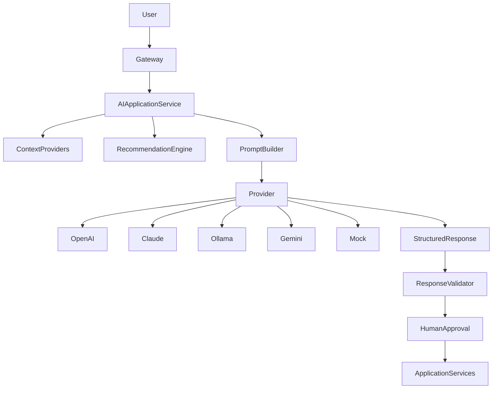
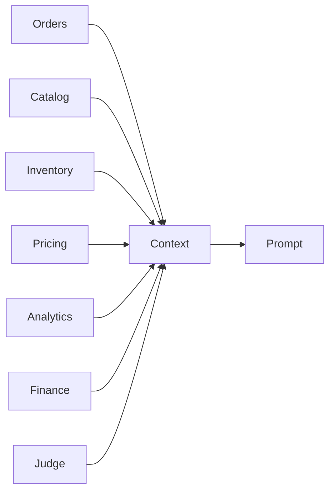
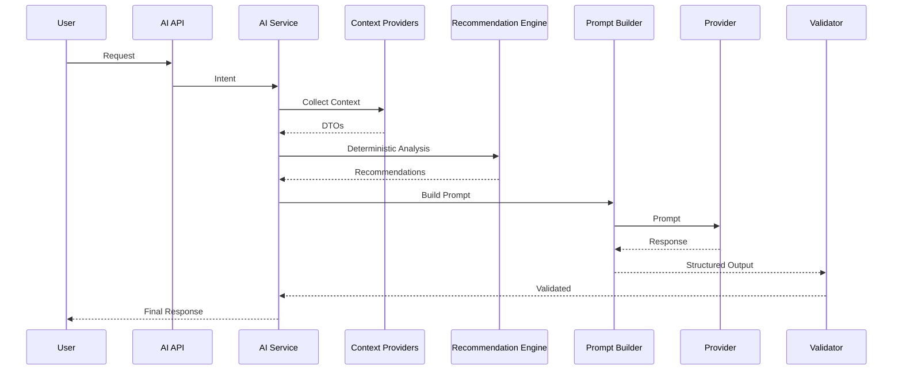

# context/10-ai/ai-architecture.md

# AI Architecture

**Version:** 1.0  
**Status:** Active  
**Owner:** Platform Architecture  
**Context:** Artificial Intelligence Platform

---

# Objetivo

Este documento define a arquitetura oficial de Inteligência Artificial do JudgeTCG.

A arquitetura foi desenhada para permitir:

- múltiplos copilotos;
- múltiplos modelos;
- múltiplos providers;
- múltiplos agentes;
- múltiplas ferramentas;
- múltiplos contextos;
- evolução contínua da plataforma sem acoplamento ao domínio.

A IA é considerada um **Application Capability**, nunca um Domain Model.

---

# Filosofia

A IA deve atuar como um colaborador especializado.

Nunca como uma autoridade.

Toda autoridade continua pertencendo aos:

- Aggregates
- Domain Services
- Application Services
- Policies
- State Machines

A IA apenas interpreta informações produzidas por essas camadas.

---

# Princípios Arquiteturais

## AI-First

A plataforma deve ser desenhada considerando IA como uma capacidade nativa.

Isso significa:

- APIs preparadas para consumo por agentes
- eventos utilizáveis por IA
- read models especializados
- observabilidade completa
- prompts versionados

---

## AI-Native

Cada módulo pode possuir um copiloto.

Exemplo:

```
Marketplace

↓

Marketplace Copilot

--------------------

Catalog

↓

Catalog Copilot

--------------------

Seller

↓

Seller Copilot

--------------------

Buyer

↓

Buyer Copilot
```

Cada copiloto possui responsabilidades próprias.

---

## AI-Decoupled

A IA nunca depende diretamente do domínio.

Sempre existe uma camada intermediária.

```
Domain

↓

Application Service

↓

AI

↓

UI
```

Nunca:

```
AI

↓

Aggregate
```

---

# Arquitetura Geral



---

# Componentes

A arquitetura é composta por nove camadas.

```
Presentation

↓

AI Gateway

↓

Application Service

↓

Context Providers

↓

Recommendation Engine

↓

Prompt Builder

↓

LLM Provider

↓

Validation

↓

Response
```

---

# AI Gateway

Responsável por receber solicitações.

Funções:

- autenticação
- autorização
- tenant isolation
- auditoria
- feature flags
- rate limit
- roteamento

Não executa IA.

---

# AI Application Service

Representa o ponto de entrada da inteligência artificial.

Exemplo:

```
SellerAIService

BuyerAIService

JudgeAIService

CatalogAIService

AdminAIService
```

Responsabilidades:

- orquestrar
- montar contexto
- selecionar provider
- validar resposta
- emitir telemetria

Nunca contém lógica de domínio.

---

# Context Providers

Cada provider coleta apenas um tipo de informação.

Exemplo:

```
OrdersContextProvider

InventoryContextProvider

PricingContextProvider

CatalogContextProvider

AnalyticsContextProvider

FinanceContextProvider

JudgeContextProvider
```

Cada provider consulta apenas:

Application Services

Read Models

Projections

Nunca SQL.

Nunca Repository.

Nunca Aggregate.

---

# Recommendation Engine

Antes do LLM existe uma etapa determinística.

```
Dados

↓

Scoring

↓

Ranking

↓

Priorização

↓

Recomendações

↓

LLM
```

A IA nunca calcula regras de negócio.

Ela apenas explica o resultado.

---

# Prompt Builder

Recebe:

- contexto
- intenção
- perfil
- idioma
- ferramentas disponíveis
- versão do prompt

Produz:

```
Prompt

↓

Messages

↓

System Prompt

↓

Developer Prompt

↓

User Prompt
```

Todos são versionados.

---

# Provider Layer

Abstração responsável pela comunicação com modelos.

Interface única.

```text
LlmProvider

↓

OpenAI

Claude

Gemini

Azure OpenAI

Ollama

Mock
```

Trocar o provider não deve alterar o restante da arquitetura.

---

# Response Validator

Toda resposta passa por validação.

Valida:

- JSON
- Schema
- Hallucination Score
- Confidence
- Allowed Tools
- Safety
- Policy

Respostas inválidas nunca chegam ao usuário.

---

# Human Approval

Sempre que houver impacto operacional.

Fluxo:

```text
AI

↓

Plano

↓

Usuário

↓

Confirmar

↓

Command

↓

Aggregate
```

Nunca:

```text
AI

↓

Database
```

---

# AI Context Assembly

O contexto nunca é carregado de forma monolítica.

Cada provider retorna um DTO independente.



Isso reduz custo e facilita cache.

---

# Context Window Strategy

O sistema utiliza montagem incremental.

Etapas:

1. intenção

↓

2. contexto mínimo

↓

3. expansão sob demanda

↓

4. ferramentas

↓

5. RAG

↓

6. prompt final

Nunca enviar todo o contexto.

---

# RAG

A arquitetura suporta Retrieval Augmented Generation.

Fontes:

- Rules
- Oracle
- Tournament Policy
- Card Catalog
- Documentation
- ADRs
- Help Center

Cada fonte possui índice independente.

---

# Tool Calling

Os modelos nunca recebem acesso ao backend.

Recebem apenas ferramentas registradas.

Exemplo:

```
SearchCards

SearchOrders

SearchListings

SearchCustomers

GetCatalogStats

PricingSuggestion

JudgeRulesSearch

GetAnalytics

PreparePriceUpdate
```

As ferramentas chamam:

Application Services.

---

# Multi-Agent Architecture

A arquitetura prevê agentes especializados.

```text
Coordinator

↓

Seller Agent

Buyer Agent

Judge Agent

Catalog Agent

Support Agent

Analytics Agent
```

Todos compartilham contratos.

Nunca estado interno.

---

# Long-Term Evolution

A arquitetura é compatível com:

- MCP
- Agent2Agent
- Semantic Kernel
- LangGraph
- OpenAI Responses API
- Anthropic Tool Use
- Local Models
- Edge Inference

Sem alterar contratos.

---

# Segurança

Toda requisição passa por:

- Authentication
- Authorization
- Tenant Resolution
- Permission Check
- Feature Flag
- Rate Limit
- Prompt Sanitization
- Output Validation

---

# Observabilidade

Cada execução gera telemetria.

Campos mínimos:

```
request_id

correlation_id

tenant

user

provider

model

prompt_version

tool_count

tokens_input

tokens_output

latency

estimated_cost

cache_hit

hallucination_score

confidence
```

---

# Escalabilidade

A arquitetura suporta:

Horizontal Scaling

Stateless AI Services

Distributed Cache

Prompt Cache

Semantic Cache

Streaming

Background Jobs

Queue-based Tool Execution

---

# Padrões Utilizados

- Clean Architecture
- DDD
- CQRS
- Hexagonal Architecture
- Provider Pattern
- Strategy Pattern
- Factory Pattern
- Builder Pattern
- Orchestrator Pattern
- Pipeline Pattern
- Chain of Responsibility
- Specification Pattern

---

# Anti-patterns

Nunca:

❌ SQL dentro da IA

❌ Repository dentro do provider

❌ Aggregate dentro do prompt

❌ LLM decidindo regra

❌ Prompt gigante

❌ Provider acoplado

❌ Ferramenta chamando banco

❌ Resposta sem validação

❌ Execução automática

❌ Prompt hardcoded

---

# Fluxo Completo



---

# Decisões Arquiteturais (ADR)

## ADR-001

Toda IA consome apenas Application Services.

---

## ADR-002

Toda regra de negócio permanece no domínio.

---

## ADR-003

Todo provider implementa uma interface única.

---

## ADR-004

Toda resposta passa por validação estrutural.

---

## ADR-005

Nenhuma IA altera estado sem confirmação humana.

---

## ADR-006

Todo contexto é modular e incremental.

---

## ADR-007

Prompts são ativos versionados da plataforma.

---

## ADR-008

Ferramentas representam contratos públicos do sistema.

---

# Roadmap Evolutivo

## Fase Atual

- Seller AI
- Buyer AI
- Judge AI
- Prompt Registry
- Tool Registry
- Recommendation Engine

## Próxima Fase

- Agent Orchestration
- Semantic Memory
- Conversation Memory
- Multi-Agent Collaboration
- Planning Engine
- Autonomous Workflows (Human-in-the-loop)
- AI Marketplace
- Self-Evaluation Pipeline
- Prompt A/B Testing
- Knowledge Distillation

---

# Conclusão

A arquitetura de IA do JudgeTCG foi projetada para ser independente dos modelos de linguagem, escalável e orientada por domínio.

Os modelos são componentes substituíveis. O verdadeiro valor da plataforma está na combinação entre Context Providers, Recommendation Engine, Application Services e Tool Registry.

Essa separação garante evolução contínua da plataforma sem acoplamento tecnológico e mantém a IA como uma capacidade confiável, auditável e segura.