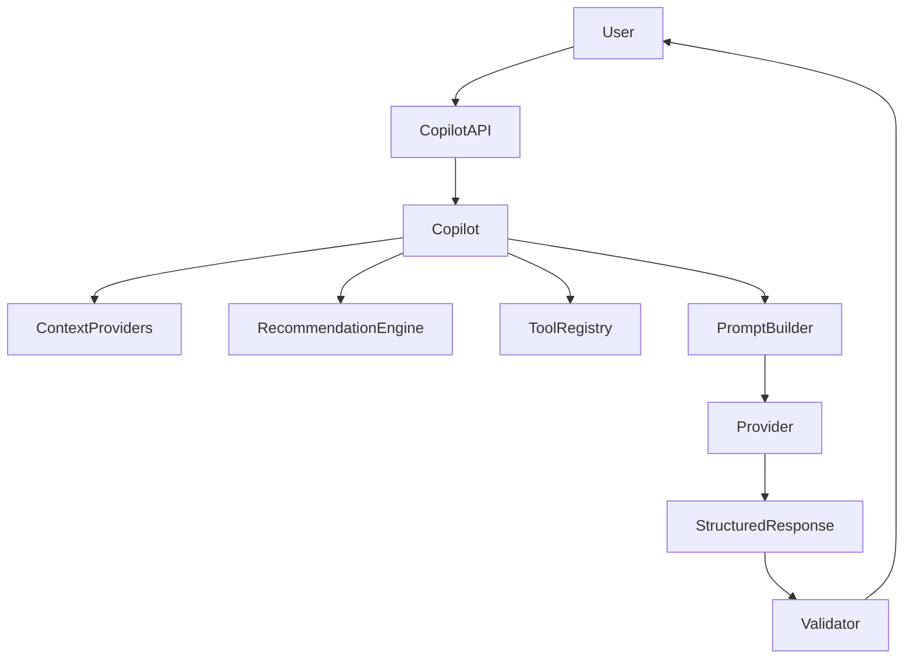
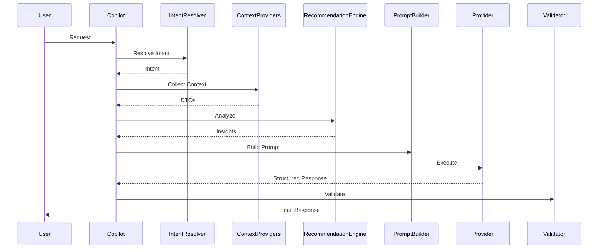

# context/10-ai/copilot.md

# Copilot Architecture

**Version:** 1.0  
**Status:** Active  
**Owner:** AI Platform Team  
**Context:** Artificial Intelligence Platform

---

# Objetivo

Este documento define a arquitetura oficial dos **Copilots** do JudgeTCG.

Um Copilot representa um assistente especializado em um domínio da plataforma.

Ele não é um chatbot.

Ele não possui conhecimento próprio.

Ele não contém regras de negócio.

Ele é um **Application Service Inteligente** responsável por:

- compreender intenção;
- reunir contexto;
- utilizar ferramentas;
- produzir recomendações;
- gerar respostas estruturadas.

---

# Filosofia

Cada Copilot possui um único objetivo.

Ele deve ser especialista apenas em seu domínio.

Exemplo:

```
Seller Copilot

↓

Especialista em operações da loja

----------------------------

Buyer Copilot

↓

Especialista em decisões de compra

----------------------------

Judge Copilot

↓

Especialista em regras oficiais

----------------------------

Catalog Copilot

↓

Especialista no catálogo global

----------------------------

Admin Copilot

↓

Especialista na operação da plataforma
```

Nenhum Copilot conhece todo o sistema.

---

# Arquitetura



---

# Responsabilidades

Todo Copilot possui exatamente as seguintes responsabilidades:

## Compreender intenção

Exemplo:

```
"Quais produtos devo anunciar hoje?"

↓

Intent:

seller.pricing.opportunity
```

---

## Solicitar contexto

Nunca consulta banco diretamente.

Solicita apenas:

- Application Services
- Read Models
- DTOs
- Projections

---

## Utilizar ferramentas

Pode utilizar:

```
Search Cards

Pricing

Analytics

Orders

Inventory

Judge

Catalog

Recommendations
```

Nunca executa SQL.

Nunca acessa Repository.

---

## Construir Prompt

Recebe:

- intenção
- contexto
- ferramentas
- idioma
- perfil

Produz:

```
System Prompt

Developer Prompt

User Prompt
```

---

## Chamar Provider

O Copilot não conhece OpenAI.

Não conhece Claude.

Conhece apenas:

```
LlmProvider
```

---

## Validar resposta

Toda resposta deve ser:

- estruturada
- validada
- segura
- auditável

---

# Estrutura Base

Todo Copilot implementa o mesmo contrato.

```typescript
interface Copilot {

    id: string;

    domain: string;

    supports(intent): boolean;

    collectContext();

    buildPrompt();

    callProvider();

    validate();

    prepareActions();

}
```

---

# Copilot Lifecycle



---

# Seller Copilot

## Objetivo

Auxiliar lojistas.

Nunca administrar a loja.

---

## Pode

- resumir vendas
- detectar problemas
- sugerir preços
- explicar métricas
- organizar prioridades
- resumir analytics
- identificar oportunidades
- sugerir melhorias

---

## Nunca

- alterar estoque
- publicar anúncios
- cancelar pedidos
- responder tickets automaticamente
- aprovar pagamentos
- alterar reputação

---

## Exemplos

```
Produtos com estoque crítico.

↓

Sugestão:

Repor estoque.
```

---

```
Preço acima do mercado.

↓

Sugestão:

Reduzir em 6%.
```

---

# Buyer Copilot

Objetivo:

Auxiliar decisões de compra.

---

Pode:

- comparar ofertas
- sugerir lojas
- explicar diferenças
- resumir avaliações
- recomendar cartas
- avisar quedas de preço
- montar carrinho inteligente

---

Nunca:

- comprar
- pagar
- cancelar pedidos
- aceitar substituições
- concluir checkout

---

Exemplo

```
Existe uma oferta
R$42 mais barata
em outra loja.

↓

Deseja visualizar?
```

---

# Judge Copilot

Especialista em regras.

Fontes permitidas:

- Comprehensive Rules
- Oracle
- Tournament Rules
- Policy Documents
- RAG

Sempre cita fonte.

Nunca inventa regras.

---

Exemplo

```
Resposta

↓

Fonte

↓

Rule 704.5
```

---

# Catalog Copilot

Especialista no catálogo.

Pode:

- explicar mecânicas
- relacionar cartas
- sugerir staples
- explicar sinergias
- resumir histórico

Nunca altera catálogo.

---

# Admin Copilot

Especialista operacional.

Pode:

- resumir incidentes
- detectar padrões
- sugerir investigações
- resumir dashboards
- identificar gargalos

Nunca altera configurações.

---

# Support Copilot

Especialista em atendimento.

Pode:

- resumir tickets
- classificar prioridade
- sugerir respostas
- identificar duplicados

Nunca responde automaticamente.

---

# Future Copilots

Arquitetura preparada para:

```
Collection Copilot

Deck Copilot

Tournament Copilot

Finance Copilot

CRM Copilot

Marketing Copilot

Fraud Copilot

Compliance Copilot

Developer Copilot
```

Sem alterar a arquitetura existente.

---

# Copilot Context

Todo Copilot recebe um objeto único.

```typescript
CopilotContext {

tenant

user

store

permissions

language

featureFlags

intent

conversation

contextProviders

availableTools

promptVersion

}
```

Esse objeto é imutável durante a execução.

---

# Tool Selection

O Copilot nunca possui ferramentas fixas.

As ferramentas são resolvidas dinamicamente.

Exemplo:

```
Buyer

↓

Search Cards

Search Listings

Wishlist

Collection

Cart

--------------------

Seller

↓

Pricing

Orders

Analytics

Inventory

Tickets
```

---

# Response Model

Toda resposta segue estrutura única.

```typescript
CopilotResponse {

summary

confidence

recommendations

warnings

citations

actions

metadata

}
```

---

# Action Model

O Copilot nunca executa ações.

Ele apenas prepara planos.

```typescript
PreparedAction {

title

description

command

requiresConfirmation

estimatedImpact

}
```

---

Exemplo

```
Atualizar preço

↓

Command:

UpdateListingPrice

↓

requiresConfirmation=true
```

---

# Confidence Score

Toda resposta possui confiança.

Escala:

```
0.0

↓

1.0
```

Exemplo

```
0.98

Alta confiança

-----------------

0.41

Resposta incompleta
```

Respostas abaixo do limite configurado podem exigir aviso ao usuário ou fallback para resposta determinística.

---

# Streaming

Todos os Copilots devem suportar streaming.

Estados:

```
Collecting Context

↓

Analyzing

↓

Generating

↓

Validating

↓

Completed
```

A UI deve refletir esses estados.

---

# Observabilidade

Cada execução registra:

- copilot
- provider
- modelo
- prompt_version
- intent
- ferramentas utilizadas
- contexto carregado
- latência
- tokens
- custo
- confiança
- cache hit
- falhas
- correlation_id

---

# Segurança

Todo Copilot respeita:

- RBAC
- ABAC
- Tenant Isolation
- Feature Flags
- Tool Permissions
- Prompt Sanitization
- Output Validation
- Rate Limiting

---

# Anti-patterns

Nunca:

❌ SQL dentro do Copilot

❌ Repository

❌ Aggregate

❌ Regras de negócio

❌ Prompt hardcoded

❌ Tool fixa

❌ Provider específico

❌ Execução automática

❌ Alteração de estado

❌ Respostas sem validação

---

# Decisões Arquiteturais (ADR)

## ADR-001

Todo Copilot é um Application Service.

---

## ADR-002

Copilots são especializados por domínio.

---

## ADR-003

Contexto sempre é obtido através de Context Providers.

---

## ADR-004

Toda resposta utiliza o mesmo contrato (`CopilotResponse`).

---

## ADR-005

Ações sempre são preparadas, nunca executadas.

---

## ADR-006

Providers são intercambiáveis.

---

## ADR-007

Um Copilot pode utilizar múltiplas ferramentas em uma única execução.

---

## ADR-008

Nenhum Copilot depende diretamente de outro Copilot.

A colaboração entre eles deve ocorrer futuramente através de um **Agent Orchestrator**, preservando baixo acoplamento e isolamento de responsabilidades.

---

# Roadmap

## Fase Atual

- Seller Copilot
- Buyer Copilot
- Judge Copilot

## Próxima Fase

- Multi-Agent Orchestrator
- Planner Agent
- Reflection Agent
- Conversation Memory
- Semantic Memory
- Background Agents
- Scheduled Copilots
- Workflow Copilots
- Agent-to-Agent Communication (A2A)
- MCP (Model Context Protocol)

---

# Conclusão

Os Copilots do JudgeTCG representam assistentes especializados orientados por domínio, construídos sobre Application Services, Context Providers e Tool Registry.

Eles não substituem a lógica da plataforma. Eles tornam essa lógica acessível, explicável e inteligente para usuários finais, preservando a separação entre domínio, aplicação e inteligência artificial.