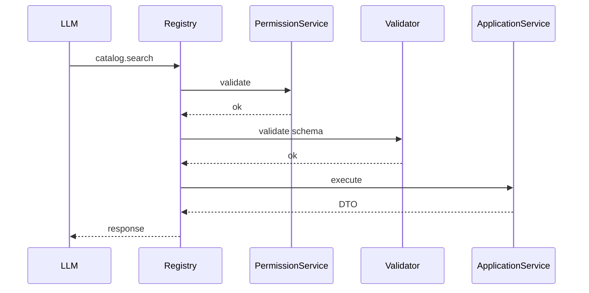

# context/10-ai/tool-registry.md

# Tool Registry

**Version:** 1.0  
**Status:** Active  
**Owner:** AI Platform Team  
**Context:** Artificial Intelligence Platform

---

# Objetivo

Este documento define a arquitetura oficial do **Tool Registry** do JudgeTCG.

O Tool Registry é a camada responsável por disponibilizar capacidades da plataforma para os Copilots e LLMs de forma segura, auditável e desacoplada.

Uma Tool representa uma **capacidade pública** da plataforma.

Ela **não representa um endpoint HTTP**, **não representa um Repository** e **não representa uma tabela**.

Ela representa uma operação de negócio exposta para IA.

---

# Filosofia

O modelo de linguagem nunca conversa diretamente com:

- banco de dados
- repositories
- aggregates
- APIs internas
- Redis
- Supabase
- PostgreSQL

Sempre conversa com:

```
Tool

↓

Application Service

↓

Domain

↓

Read Models
```

---

# Arquitetura

```mermaid
flowchart TD

LLM

↓

Tool Registry

↓

Tool

↓

Application Service

↓

Domain

↓

Response DTO

↓

LLM
```

---

# Responsabilidades

O Tool Registry é responsável por:

- registrar ferramentas
- resolver ferramentas
- validar permissões
- validar parâmetros
- executar ferramentas
- auditar chamadas
- emitir telemetria
- controlar timeout
- controlar rate limit
- validar schemas

Nunca contém regras de negócio.

---

# O que é uma Tool

Uma Tool representa uma única capacidade.

Exemplo:

```
Pesquisar cartas

Consultar pedidos

Buscar analytics

Consultar catálogo

Preparar alteração de preço

Consultar reputação
```

Cada Tool possui apenas uma responsabilidade.

---

# O que NÃO é uma Tool

Não criar ferramentas como:

```
execute_sql()

delete_listing()

update_database()

call_api()

repository_query()

generic_search()

run_python()
```

Essas funções violam o isolamento arquitetural.

---

# Arquitetura Geral

```
Copilot

↓

Tool Registry

↓

Tool Descriptor

↓

Permission Check

↓

Validation

↓

Application Service

↓

DTO

↓

LLM
```

---

# Registro Central

Todas as ferramentas devem estar registradas.

```text
Tool Registry

↓

Catalog Tools

Marketplace Tools

Seller Tools

Buyer Tools

Judge Tools

Analytics Tools

Pricing Tools

Inventory Tools

Finance Tools

Support Tools
```

Nenhuma Tool pode ser descoberta automaticamente.

---

# Estrutura

Cada Tool possui:

```typescript
Tool {

id

name

description

category

version

inputSchema

outputSchema

permissions

featureFlags

timeout

handler

}
```

---

# Categorias

## Catalog

```
SearchCards

GetCardDetails

GetCardMarket

GetCardVariants

GetRelatedCards
```

---

## Marketplace

```
SearchListings

CompareOffers

SmartCart

StoreSearch

SearchStores
```

---

## Seller

```
GetDashboard

GetInventory

GetPricing

GetOrders

GetTickets

GetAnalytics

GetFinance

PreparePriceUpdate

PrepareInventoryUpdate
```

---

## Buyer

```
Wishlist

Collection

DeckShopping

BuyerDashboard

Recommendations

FavoriteStores
```

---

## Judge

```
SearchRules

SearchOracle

SearchPolicy

SearchErrata

JudgeHistory
```

---

## Analytics

```
SalesAnalytics

MarketAnalytics

ListingAnalytics

BuyerAnalytics

StoreAnalytics
```

---

## Reputation

```
StoreTrust

SellerLevel

SellerHistory

PublicTrustScore
```

---

## Support

```
TicketSummary

SearchTickets

CustomerHistory

SuggestedResponse
```

---

# Tool Descriptor

Toda ferramenta possui um descriptor.

Exemplo

```json
{
  "id":"catalog.search_cards",

  "version":"1",

  "category":"catalog",

  "description":"Search cards by filters",

  "permissions":[
      "catalog.read"
  ],

  "timeout":5000
}
```

---

# Input Schema

Toda Tool deve possuir schema.

Exemplo

```json
{
    "query":"Charizard",

    "game":"pokemon",

    "language":"en",

    "limit":20
}
```

Schemas são obrigatórios.

---

# Output Schema

A resposta também possui contrato.

Exemplo

```json
{

cards:[...]

metadata:{}

pagination:{}

}
```

Nunca retornar objetos arbitrários.

---

# Tool Resolution

Fluxo



---

# Descoberta

O LLM recebe apenas ferramentas permitidas.

Exemplo

Buyer

↓

```
Wishlist

Collection

SearchCards

CompareOffers
```

Seller

↓

```
Inventory

Pricing

Orders

Analytics
```

Judge

↓

```
Rules

Oracle

Policy
```

---

# Tool Permissions

Toda ferramenta declara permissões.

Exemplo

```
catalog.read

seller.orders.read

analytics.read

judge.rules.read
```

Sem permissão:

Tool indisponível.

---

# Feature Flags

Ferramentas podem ser ativadas por feature flag.

Exemplo

```
seller_ai

buyer_ai

judge_ai

catalog_ai

beta_tools

reasoning_tools
```

---

# Multi-Tenant

Toda Tool recebe:

```typescript
ToolContext {

tenant

user

store

permissions

language

requestId

correlationId

}
```

Nunca acessar contexto global.

---

# Timeout

Cada Tool possui timeout.

Exemplo

```
Catalog

2 s

Analytics

5 s

Judge

10 s

Pricing

3 s
```

Após timeout.

Retornar erro estruturado.

---

# Idempotência

Ferramentas devem ser preferencialmente idempotentes.

Exemplo

```
SearchCards

OK

---------------

CompareOffers

OK

---------------

PreparePriceUpdate

OK

---------------

PublishListing

NÃO
```

Execução de comandos pertence ao domínio.

---

# Prepared Actions

Ferramentas nunca executam comandos destrutivos.

Exemplo

```
PreparePriceUpdate

↓

Command DTO

↓

Human Confirmation

↓

Application Service
```

Nunca:

```
UpdatePrice()

automaticamente
```

---

# Telemetria

Toda execução registra:

```
tool_id

tool_version

latency

input_size

output_size

success

failure

timeout

provider

copilot

user

tenant

request_id

correlation_id
```

---

# Observabilidade

Métricas:

```
Calls/min

Latency

Error Rate

Timeout Rate

Cache Hit

Permission Denied

Validation Errors
```

---

# Cache

Ferramentas podem utilizar cache.

Tipos:

```
Memory

Redis

Semantic

Projection Cache
```

Nunca cachear comandos.

---

# Segurança

Toda Tool deve:

- validar entrada
- validar saída
- validar tenant
- validar permissões
- validar feature flag
- sanitizar parâmetros

Nunca confiar no LLM.

---

# Versionamento

Toda Tool possui versão.

Exemplo

```
catalog.search_cards.v1

catalog.search_cards.v2

catalog.search_cards.v3
```

Versões antigas permanecem enquanto houver consumidores.

---

# Testabilidade

Toda Tool possui:

- testes unitários
- testes de integração
- contrato
- schema validation
- mock

Nenhuma Tool depende do provider de IA.

---

# Anti-patterns

Nunca:

❌ SQL

❌ Repository

❌ Aggregate

❌ HTTP externo diretamente

❌ Tool genérica

❌ Tool sem schema

❌ Tool sem timeout

❌ Tool sem auditoria

❌ Tool retornando entidades do domínio

❌ Tool alterando estado automaticamente

---

# ADRs

## ADR-001

Toda Tool representa uma capacidade pública da plataforma.

---

## ADR-002

Ferramentas nunca chamam Repositories diretamente.

---

## ADR-003

Toda Tool possui Input e Output Schema.

---

## ADR-004

Toda execução gera telemetria.

---

## ADR-005

Ferramentas são registradas explicitamente.

---

## ADR-006

Permissões são avaliadas antes da execução.

---

## ADR-007

Prepared Actions substituem comandos automáticos.

---

## ADR-008

Application Services são o único ponto permitido para acesso ao domínio.

---

# Roadmap

## Atual

- Catalog Tools
- Seller Tools
- Buyer Tools
- Judge Tools
- Analytics Tools

## Futuro

- MCP Tool Registry
- Dynamic Tool Discovery
- Tool Marketplace
- Remote Tools
- Federated Tools
- Workflow Tools
- Multi-Agent Shared Tools
- Tool Sandboxing
- Tool Cost Optimizer
- Tool Health Dashboard

---

# Conclusão

O Tool Registry é a camada que transforma as capacidades do JudgeTCG em operações consumíveis por IA de forma segura, previsível e auditável.

Ao impedir que LLMs acessem diretamente o domínio, bancos de dados ou APIs internas, o Tool Registry preserva a arquitetura DDD da plataforma e estabelece um contrato estável para a evolução futura, incluindo suporte a MCP, agentes especializados e ecossistemas multi-agente.