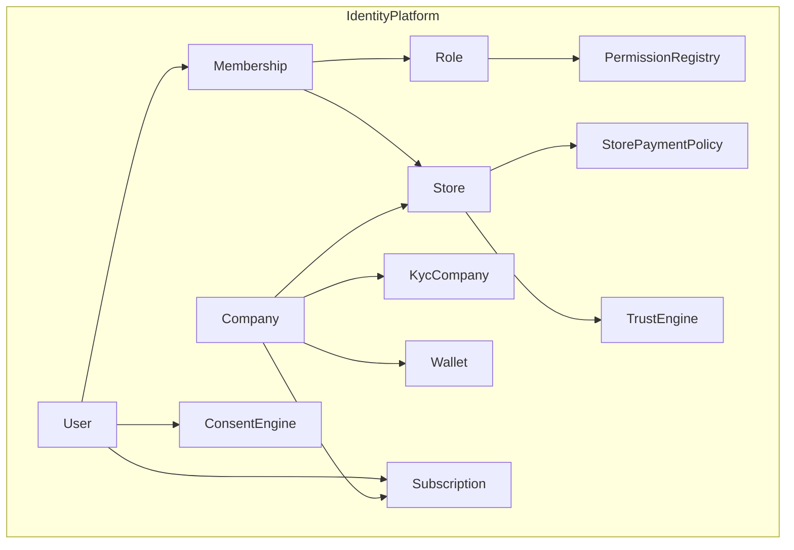

# Business Program 1 — Identity, Organizations & Business Model

**Status:** Implemented (additive, RC1-compatible)  
**Package:** `services/api/app/identity_platform/`  
**Migration:** `supabase/migrations/20260715120000_business_program_1_identity.sql`  
**API prefix:** `/runtime/judge/identity`

## Architecture

Identity Platform introduces bounded contexts alongside RC1 without rewriting public checkout, analytics, marketplace product flows, or Product Intelligence.



### Compatibility projection

| New | RC1 source |
|-----|------------|
| User | `player_profiles` (+ CPF KYC) |
| Company | new table; lazy bootstrap from store owner |
| Store | `stores` + nullable `company_id` |
| Membership | `memberships` ↔ `store_user_roles` + implicit owner |
| Role/Permission | registry + map to `seller_rbac` |
| Subscription | `platform_subscriptions` ↔ `stores.subscription_plan` |
| Trust | snapshots + bridge `reputation_engine` |
| Wallet / KYC / Consent / Policy | schema + services; no checkout wire |

## Package layout

```
identity_platform/
  domain/          # enums, CNPJ, entities
  permissions/     # PermissionRegistry, RoleCatalog, PermissionService
  services/        # User, Company, StoreOrg, Membership, Invitation, …
  adapters/        # rc1_user, rc1_store, rc1_membership
  api.py           # FastAPI router
```

## Bounded contexts

1. **User Identity** — person projection, consents, MFA/passkey flags  
2. **Company** — CNPJ entity, representatives, KYC case  
3. **Store Org** — link store↔company, payment policies  
4. **Membership / Invitation / RBAC** — roles without boolean flags  
5. **Subscription / Wallet / Trust / Consent** — prepared commercial layer  

## Permission rule

All authorization goes through `PermissionService.can(actor_id, permission, store_id=…|company_id=…)`.  
Never `if role == owner` or `if user.is_seller`. Dual-read falls back to legacy `seller_rbac` until cutover.

## Migration risks

| Risk | Mitigation |
|------|------------|
| Fake CNPJ backfill | No automatic company in SQL; `ensure_from_store_owner` creates `pending_cnpj` |
| Seller panel breakage | Dual-write off by default; RC1 `store_user_roles` remains source of truth for FE |
| Checkout coupling | Wallet/policies not wired to `shop_checkout` |
| Schema drift | All new tables under `tcg_judge.*`; `stores.company_id` nullable |

## Zero-downtime rollout

1. Deploy migration (nullable columns / new tables).  
2. Deploy identity API (new routes only; dual-read).  
3. Enable `IDENTITY_DUAL_WRITE=true` in staging first.  
4. No seller panel cutover until Program 2.  
5. Rollback = disable flag; ignore new tables; ownership/team legacy intact.

## Internal APIs (auth: existing JWT / `X-Judge-User-Id`)

| Method | Path | Purpose |
|--------|------|---------|
| GET | `/me` | User + consents + buyer role |
| GET/PATCH | `/companies/me` | Owner company |
| POST | `/companies` | Create (CNPJ checksum) |
| GET | `/stores/{id}/org` | Store + company + policies |
| GET | `/stores/{id}/memberships` | List |
| POST | `/stores/{id}/invitations` | Invite |
| POST | `/invitations/{token}/accept` | Accept → Membership |
| GET | `/permissions/check` | `can()` |
| GET | `/permissions/catalog` | Registry |
| GET | `/subscriptions/me` | Plans |
| GET | `/wallets/me` | Balances |
| GET | `/trust/store/{id}` | Score |
| GET | `/trust/buyer/me` | Score (not shown to buyer) |
| GET/POST | `/kyc/company/{id}` | KYC case |
| GET/POST | `/consents` | LGPD |

## Backlog — Programs 2–4

- **P2:** FE multi-org / invitations UI; dual-write ON; Membership-only cutover; company onboarding wizard  
- **P3:** Wallet in checkout; Receita / Open Banking; settlement credits  
- **P4:** Multi-country tax IDs; multi-currency wallets; region compliance packs  

## Related docs

See `docs/business/` for domain deep-dives and `BUSINESS_PROGRAM_1_REPORT.md` for acceptance checklist.
