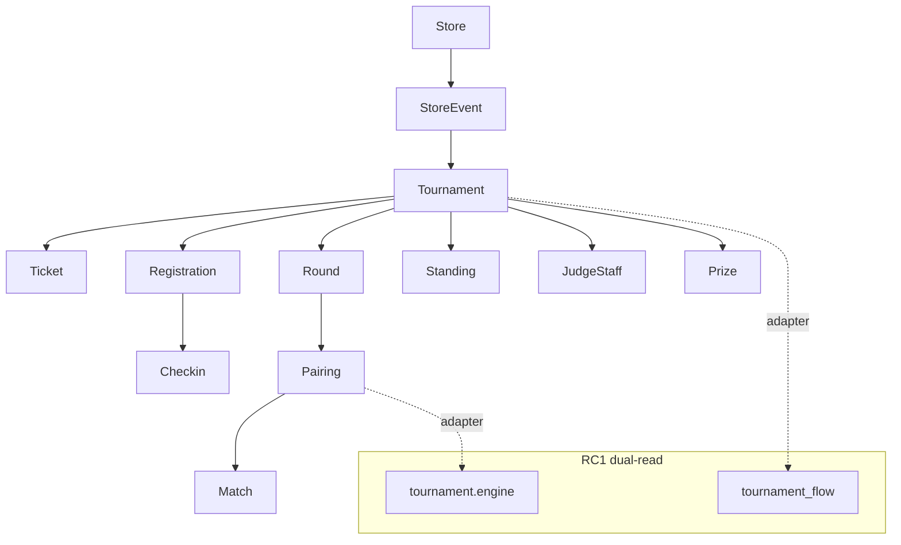

# Business Program 2 — Tournament Platform

**Status:** Implemented (additive, RC1-compatible)  
**Package:** `services/api/app/tournament_platform/`  
**Migration:** `supabase/migrations/20260716120000_business_program_2_tournament_platform.sql`

## Architecture

## Bounded contexts

StoreEvent, Tournament, Ticket, Registration, Checkin, Judge staff, Pairing, Round, Match, Standing, Prize, Decklist archive, Penalty, Tournament Analytics (marts), Settings (policies JSONB).

## Full tournament cycle

1. Store creates **StoreEvent** (`POST .../tournament-platform/events`)  
2. Link 0..N RC1 **tournaments** (`link-tournament`)  
3. Create **tickets** (EVENT inventory contract; checkout not wired)  
4. Player **registration** → payment advance → confirm  
5. **Check-in** (manual/qr/code/list)  
6. RC1 **rounds / pairings / results** (existing flow APIs)  
7. **Standings** via façade  
8. **Penalties / prizes** recorded on platform tables  
9. **Finalize** via RC1; emit `tournament_finished`  
10. Dashboards / marts for observability  

## Rollout (zero downtime)

1. Apply migration (nullable columns + new tables)  
2. Deploy API tournament_platform  
3. FE shells on new routes only  
4. Dual-write off by default  
5. Rollback = ignore new tables; RC1 flow unchanged  

## Backlog — Business Program 3 (Financial Platform)

- Ticket SKU enforced in marketplace checkout (EVENT inventory)  
- Settlement → wallet / store credit prize payouts  
- Entry-fee reconciliation + chargebacks for events  
- Automatic prize distribution ledger  
- Store tournament P&amp;L reports  
- Connect Stripe Connect / PIX splits for organizers  
- Cutover dual-write Registrations → participants mandatory  

See `docs/tournament/` for domain deep-dives.
