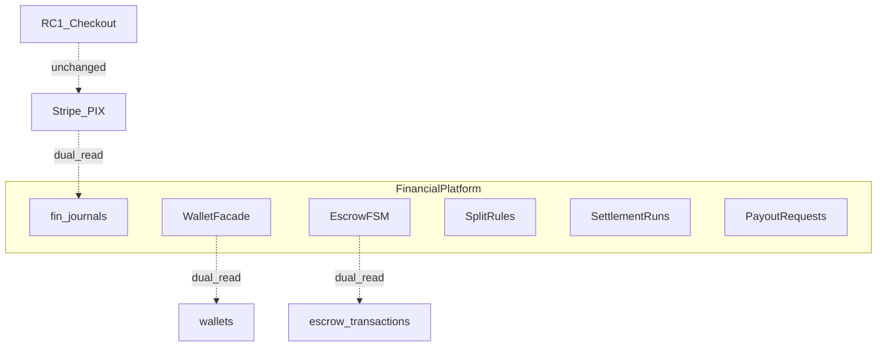

# Business Program 3 — Financial Platform

**Status:** Implemented (additive)  
**Package:** `services/api/app/financial_platform/`  
**Migration:** `supabase/migrations/20260717120000_business_program_3_financial_platform.sql`

## Architecture

## Sale → escrow → payout flow (target)

1. Buyer pays (Stripe/PIX) — **RC1 checkout**  
2. Platform records escrow case (`held`)  
3. Delivery confirmation  
4. Escrow `released`  
5. Split engine allocates marketplace/store/…  
6. Settlement run close  
7. Payout request → processing → completed (Connect stub)  

Day-1: steps 2–7 available via Financial Platform APIs; checkout not intercepted.

## Reconciliation model

- Source of truth for capture: `payments` / PSP  
- Platform journals append-only with idempotency keys  
- Marts snapshot for dashboards  
- Dual-read Sprint 6 `ledger_entries` / `settlements` / `chargebacks`  

## Rollout

1. Migration `fin_*`  
2. Deploy API  
3. `FINANCIAL_PLATFORM_DUAL_WRITE` off in prod  
4. FE shells on new routes  
5. Rollback = ignore `fin_*`; checkout intact  

## Risks

| Risk | Mitigation |
|------|------------|
| Fraud / double spend | Idempotency + audit log |
| Chargeback drift | Dual-read + fin cases FSM |
| Ledger imbalance | assert_balanced on every post |
| Checkout regression | No edits to shop_checkout / Stripe / PIX |

## Backlog — Business Program 4 (Marketplace Intelligence)

- Wallet as checkout tender (opt-in)  
- Real-time fraud scoring on journals  
- Personalized commission / cashback by cohort  
- Store financial twin (predictive payout risk)  
- Cross-marketplace price + fee intelligence  
- Automated chargeback win-rate playbooks  

See `docs/financial/` for domain docs.
