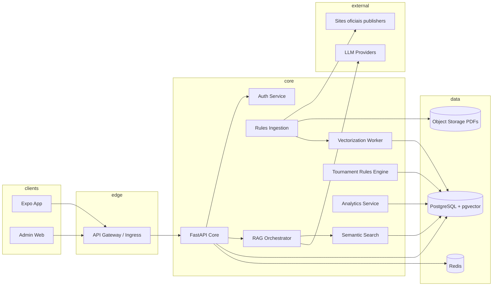

# Arquitetura do sistema

## Visão de componentes

## Clean Architecture + DDD (mapeamento)

| Camada | Responsabilidade | Pasta (API) |
|--------|------------------|-------------|
| Interface | HTTP, contratos OpenAPI | `app/api/` |
| Aplicação | Casos de uso, orquestração RAG | `app/application/` |
| Domínio | Entidades, políticas (futuro) | `app/domain/` (expandir) |
| Infraestrutura | DB, cache, clients LLM | `app/infrastructure/` |

## Event-driven (assíncrono)

Eventos sugeridos (Redis Streams / Kafka-ready):

- `rules.document.discovered`
- `rules.document.fetched`
- `rules.document.parsed`
- `rules.chunks.embedded`
- `rag.query.completed`

Workers **stateless** escalam horizontalmente; estado em Postgres + idempotência por `content_hash`.

## Kubernetes-ready

- Imagens slim multi-stage (API já em `Dockerfile`).
- Health probes: `GET /v1/health`.
- Variáveis via Secret/ConfigMap; sem credenciais no git.
- HPA sobre deployments de API e workers com base em CPU/latência.

Veja `docs/KUBERNETES.md` (stub de manifests).

## Segurança

- Rate limiting (MVP em memória; produção: Redis token bucket).
- RBAC: `users.role` + policies no Admin.
- Anti prompt-injection: classificador leve + regras de sistema + truncamento; logs de tentativas.
- Sanitização de HTML em ingestão (Bleach / nh3) antes de indexar.

## Observabilidade

- Logs JSON (`structlog`).
- Métricas: latência RAG, tokens, erros de ingestão, fila de jobs.
- Tracing: OTel (reintroduzir `FastAPIInstrumentor` quando dependências forem fixadas no lock corporativo).
