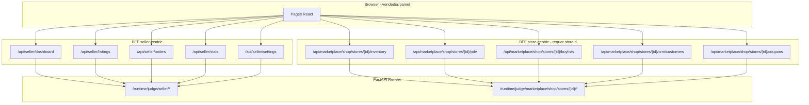

# Contexto — Avaliação de framework para o painel lojista

> Documento de apoio à decisão sobre inclusão de um framework/admin toolkit em conjunto com `/vendedor/painel`.  
> **Escopo:** painel SaaS do lojista. **Fora de escopo:** validação de CPF/KYC, perfil público `/vendedor/[sellerId]`, marketplace do comprador.

---

## 1. Objetivo

Decidir se e **qual** framework (ou combinação de bibliotecas) deve ser adotado para acelerar evolução do painel lojista, reduzir duplicação e padronizar listagens, formulários e shell administrativo — **sem** substituir backend, auth Supabase ou fluxos de pagamento/escrow já existentes.

**Pergunta central:** o painel atual escala bem para lojistas com centenas de listagens, dezenas de pedidos/dia e múltiplos módulos (estoque, PDV, BuyList, CRM)?

---

## 2. Prioridades antes / durante / depois do POC

### Prioridade ALTA — resolver antes do POC

| # | Ação | Por quê | Status |
|---|------|---------|--------|
| 1 | Documentar tema luxury completo (Anexo A) | Sem referência visual, qualquer framework é chute | ✅ neste doc |
| 2 | Medir baseline de bundle e performance | Métricas do POC precisam de referência | ✅ §15 |
| 3 | Consolidar ou documentar BFF dual (§6) | Data provider depende disso | ✅ §6 + diagrama |
| 4 | Verificar compatibilidade React 19 (§5) | Pode eliminar candidatos antes do POC | ✅ checklist §5 |
| 5 | Detalhar `planHasFeature()` (§7) | Framework precisa respeitar gates | ✅ §7 |

### Prioridade MÉDIA — durante o POC

| # | Ação | Por quê |
|---|------|---------|
| 6 | Testar POC em viewport mobile (`< 768px`) | Shell já é responsivo; grid pode quebrar UX |
| 7 | Medir cobertura de testes pós-POC | Framework deve ser testável |
| 8 | Prototipar data provider dual (se Refine for candidato) | Bloqueante para Tier B |

### Prioridade BAIXA — pós-decisão

| # | Ação | Por quê |
|---|------|---------|
| 9 | Registrar decisão em `docs/ARCHITECTURE_DECISIONS.md` | Registro técnico para futuros devs |
| 10 | Atualizar `docs/UI_GUIDE.md` e `PROJECT_CONTEXT.md` §7 | Alinhar documentação de produto |

---

## 3. Produto — o que é o painel lojista

SaaS embutido no JudgeTCG para lojistas de TCG:

| Módulo | Rota | Gate de plano |
|--------|------|---------------|
| Dashboard | `/vendedor/painel` | — |
| Listagens | `/vendedor/painel/listagens` | free+ |
| Vendas / pedidos | `/vendedor/painel/vendas` | free+ |
| Estoque + CSV | `/vendedor/painel/estoque` | free+ |
| Estatísticas | `/vendedor/painel/estatisticas` | lojista+ |
| BuyList | `/vendedor/painel/buylist` | lojista+ |
| CRM clientes | `/vendedor/painel/clientes` | lojista+ |
| PDV | `/vendedor/painel/pdv` | pro+ |
| Cupons | `/vendedor/painel/cupons` | — |
| Planos / Pro | `/vendedor/painel/planos`, `/pro` | — |
| Config (pagamentos, frete, API) | `/vendedor/painel/configuracoes/*` | pro+ (API) |
| Onboarding loja | `/vendedor/painel/onboarding` | — |

Planos definidos em `frontend/runtime_console_v3/src/lib/seller-plans.ts` (`free`, `lojista`, `pro`, `enterprise`).

Redirects legados: `/store/*` → `/vendedor/painel/*` (`next.config.mjs`).

---

## 4. Estado técnico atual (frontend)

| Camada | Tecnologia |
|--------|------------|
| App | Next.js **15.1**, App Router, React **19** |
| Estilo | Tailwind 3.4, tokens `luxury-*` + CSS vars shadcn-like |
| UI base | Radix + primitivos em `components/ui/` (shadcn parcial, **código próprio**) |
| Server state | **TanStack React Query 5** |
| Client state | Zustand (auth, carrinho) — **sem** store global do seller |
| Charts | Recharts 2.15 |
| Validação | Zod 3 (presente; uso inconsistente no painel) |
| Forms | **`useState` manual** — react-hook-form **não instalado** |
| Tabelas | **Listas/cards custom** — TanStack Table **não instalado** |

### Shell do painel

```
src/app/vendedor/painel/layout.tsx
  ├── useRequireAuth
  ├── useMerchantKycGuard  → redireciona se KYC bloqueado
  ├── useSellerStore       → React Query: /api/stores/mine + /api/seller/dashboard
  └── Sidebar (navegação + planHasFeature)
```

**Mobile hoje:** sidebar fixa em `lg+`; abaixo disso, drawer com botão `☰ Menu` (`layout.tsx`). Conteúdo das páginas usa listas/cards (não grids largos), o que ajuda em telas estreitas — mas tabelas futuras precisam degradar para cards.

Componentes dedicados: `src/components/seller-dashboard/` (12 arquivos).

---

## 5. Riscos React 19 (obrigatório no POC)

A combinação **Next.js 15 App Router + React 19 + libs de terceiros** exige validação explícita. Não basta checar `peerDependencies`.

### Problemas conhecidos / a verificar

| Lib | Risco | Ação no POC |
|-----|-------|-------------|
| **react-hook-form v7** | Issues com React 19 Strict Mode (re-registro de campos, double mount) | Instalar `react-hook-form@>=7.54.0` (POC: **7.80.0**); testar form com Strict Mode |
| **TanStack Table v8** | Peer deps nem sempre declaram React 19 | Smoke test sort + pagination em Client Component |
| **Refine v4** | Depende de RQ + router adapters; compat React 19 varia por pacote | Spike isolado em branch; checar GitHub issues abertas |
| **Next.js 15 RSC** | Client/server boundary: grids e forms devem ser `"use client"` | Evitar importar grid em Server Components |
| **Hydration** | Mismatch se grid renderiza datas/números formatados diferente server vs client | Formatar apenas no client ou usar `suppressHydrationWarning` pontual |

### Checklist de compatibilidade (bloqueante para go)

- [ ] `npm run build` sem warnings de peer deps nas libs escolhidas
- [ ] Navegação painel → listagens → editar sem erro de hydration no console
- [ ] Form POC: submit duplo não corrompe estado (Strict Mode)
- [ ] Playwright mobile (`375px`) passa no fluxo listagens
- [ ] Vitest unitário do componente grid/form passa

**Eliminação antecipada:** se react-hook-form ou TanStack Table falharem no checklist, descartar Tier A parcial e reavaliar só shadcn blocks + fetch manual.

---

## 6. BFF dual — arquitetura e data provider

### Problema (design, não só duplicação)

O painel consome **duas famílias de BFF** com contratos diferentes:



| Família | Escopo | Identificador | Usado em |
|---------|--------|---------------|----------|
| **`/api/seller/*`** | Recursos do vendedor autenticado (JWT → userId) | Implícito (sessão) | dashboard, listagens, vendas, stats, settings |
| **`/api/marketplace/shop/stores/{storeId}/*`** | Recursos da loja | `storeId` de `/api/stores/mine` | estoque, PDV, buylist, CRM, cupons, export |

Ambas passam por `tournamentProxyHeaders()` com `Authorization` + `X-Judge-User-Id`.

### Mapeamento rota → BFF

| Rota painel | BFF principal |
|-------------|---------------|
| Dashboard | `/api/seller/dashboard` + `/api/stores/mine` |
| Listagens | `/api/seller/listings` |
| Vendas | `/api/seller/orders` |
| Estoque | `/api/marketplace/shop/stores/{id}/inventory` |
| PDV | `.../pdv` |
| BuyList | `.../buylists`, `.../submissions` |
| Clientes | `.../crm/customers` |
| Estatísticas | `/api/seller/stats` |
| Cupons | `.../coupons` |
| Config API | `/api/developer/api-keys` |

### Opções para o framework

**Opção A — Data provider dual (curto prazo, recomendado para POC Refine):**

```typescript
// Esboço — não implementado
const sellerDataProvider = {
  getList: ({ resource, pagination }) => {
    if (resource.startsWith("store/")) {
      const storeId = requireStoreId();
      return fetch(`/api/marketplace/shop/stores/${storeId}/${resource.slice(6)}?...`);
    }
    return fetch(`/api/seller/${resource}?...`);
  },
};
```

**Opção B — Consolidar BFF (médio prazo):** criar `/api/seller/store/{resource}` que encapsula `storeId` server-side a partir da sessão. Reduz complexidade do frontend, exige trabalho de API.

**Decisão pré-POC:** documentar dualidade (este §6). Consolidar BFF **não** é pré-requisito para POC incremental (TanStack Table chama fetch existente). **É** pré-requisito se Refine for adotado em escala.

---

## 7. Plan gating — `planHasFeature()`

### Frontend (síncrono, UI-only)

Arquivo: `frontend/runtime_console_v3/src/lib/seller-plans.ts`

```typescript
export function planHasFeature(plan: string | undefined, feature: string): boolean {
  const p = plan || "free";
  const lojistaPlus = new Set(["lojista", "pro", "enterprise"]);
  const proPlus = new Set(["pro", "enterprise"]);
  if (["buylist", "crm", "analytics"].includes(feature)) return lojistaPlus.has(p);
  if (["pdv", "api"].includes(feature)) return proPlus.has(p);
  return false;
}
```

**Onde é usado:**

| Local | Comportamento |
|-------|---------------|
| `Sidebar.tsx` | Item com 🔒 → link para `/planos` se feature bloqueada |
| `buylist/page.tsx`, `clientes/`, `pdv/`, `estatisticas/`, `configuracoes/api/` | Early return upsell + `enabled: false` no React Query |
| `layout.tsx` | Plano vem de `dashboard.store.subscription_plan` via `useSellerStore` |

**Expiração Pro → Free:** o frontend usa o plano retornado pelo dashboard **sem** recalcular expiração localmente. Se o backend devolver `subscription_plan: "free"` após expiração, a sidebar desbloqueia/bloqueia na próxima fetch.

### Backend (autoritativo)

Arquivo: `services/api/app/marketplace/shop_store.py`

- `effective_plan(store)` — se plano pago expirou (`subscription_expires_at`), retorna `"free"`
- `store_plan_has_feature(store, feature)` — usa `effective_plan`, espelha regras do frontend (+ `custom_domain` em pro+)
- Enforced em: `shop_pdv.py`, `shop_crm.py`, `shop_buylist.py`, `shop_seller_api.py` (API pública)

Testes: `services/api/tests/marketplace/test_seller_plans.py`

### Implicações para framework

1. **Navegação:** manter `Sidebar` ou replicar lógica `planHasFeature` no menu do framework
2. **Rotas:** páginas gated devem manter guard local (early return) — Refine `<CanAccess>` ou equivalente custom
3. **Data fetching:** nunca confiar só no UI gate; backend retorna 403 se plano insuficiente
4. **Plano dinâmico:** provider deve ler `plan` de `useSellerStore()`, não constante

---

## 8. Gaps que motivam um framework

| Gap | Impacto | Onde aparece hoje |
|-----|---------|-------------------|
| Sem data grid | Sort, filtros, seleção em massa, virtualização | listagens, vendas, estoque, CRM, buylist |
| Forms ad hoc | Validação inconsistente | buylist (~300 LOC), PDV, configurações |
| Shell admin DIY | loading/empty/error repetidos | todas as rotas |
| Paginação manual | UX frágil em volume | `ListingManager`, vendas |
| BFF dual | Data provider complexo | estoque/PDV vs listagens |
| Legado `/store/*` | Re-exports | cupons, pro, onboarding |
| Páginas monolíticas | Difícil testar | buylist, estoque |

---

## 9. Restrições de integração

1. **Next.js App Router** — rotas em `src/app/vendedor/painel/**`
2. **React 19** — checklist §5 obrigatório
3. **Tema luxury** — Anexo A; evitar Material UI default sem override total
4. **Guards** — auth + KYC permanecem no `layout.tsx`
5. **Plan gating** — §7
6. **BFF pattern** — nunca expor Render no browser
7. **Bundle** — baseline §15; meta POC: **≤ +40 KB** First Load JS na rota POC vs baseline
8. **Mobile** — degradar grid → cards em `< lg`; testar 375px no POC
9. **i18n** — pt-BR only

---

## 10. Candidatos reclassificados

### Tier A — Principal (menor risco, alinhado ao luxury)

| Opção | Papel | Notas |
|-------|-------|-------|
| **shadcn/ui blocks (admin shell)** | Layout dashboard, sidebar patterns, page shells | **Código próprio**, não runtime dep — ideal para tema custom; forte candidato para **shell** |
| **TanStack Table + shadcn Data Table** | Grid CRUD | Sort, filter, paginação server-side |
| **react-hook-form + zod + shadcn Form** | Formulários | Validar React 19 §5 antes de instalar |

### Tier B — Framework completo (avaliar se Tier A insuficiente em 2 sprints)

| Opção | Papel | Notas |
|-------|-------|-------|
| **Refine** | CRUD + data provider + RQ | Requer data provider dual §6; theming pesado |
| **React Admin** | CRUD maduro | Material default — **alto risco** para luxury; React 19 incerto |

**Descartar:** AdminJS (backend Node).

### Complementar (não candidato principal)

| Opção | Papel | Notas |
|-------|-------|-------|
| **Tremor** | KPI cards / blocos analytics | Complementa Recharts em `/estatisticas`; **não resolve CRUD** |
| **Recharts** (já em uso) | Gráficos dashboard | Manter |

### Virtualização pesada (opcional, volume extremo)

| Opção | Papel | Notas |
|-------|-------|-------|
| **AG Grid Community** | Grid com virtualização | **Gratuita** (MIT); sort/filter/pagination OK |
| ~~AG Grid Enterprise~~ | — | **Fora de escopo** — row grouping, master-detail exigem licença paga (~$999+/ano) |

### Recomendação atualizada

1. **Fase 0:** shadcn blocks para `PageShell` + TanStack Table na rota listagens
2. **Fase 1:** react-hook-form + zod (após checklist React 19)
3. **Fase 2:** só então avaliar Refine se CRUD repetitivo ainda doer

---

## 11. Matriz de critérios (preencher na avaliação)

Pontuar 1–5 por candidato:

| Critério | Peso | Notas |
|----------|------|-------|
| Compatibilidade Next.js 15 App Router | 10 | RSC vs `"use client"` |
| Compatibilidade React 19 | 10 | §5 checklist |
| Integração com React Query existente | 8 | Refine nativo; TanStack Table agnóstico |
| Customização tema luxury (dark) | 8 | Anexo A |
| Data grid (sort, filter, pagination server-side) | 9 | |
| Forms + Zod | 7 | |
| **Testabilidade** (unit + E2E, helpers do framework) | **6** | Baseline §15.3 |
| Curva de aprendizado do time | 6 | |
| Tamanho do bundle (vs baseline §15) | 7 | |
| Licença / custo | 5 | AG Grid Community = OK |
| Comunidade e manutenção 2026 | 5 | |
| Esforço de migração incremental | 8 | |
| Suporte a plan gating por rota | 6 | §7 |
| Compatibilidade BFF dual (§6) | 7 | Refine precisa provider custom |

**Score mínimo para adoção:** média ponderada ≥ 3,5 após POC.

---

## 12. Estratégias de adoção

### Opção 1 — Incremental (preferida)

```
Fase 0: PageShell (shadcn blocks) + DataTable (TanStack Table)
Fase 1: /listagens
Fase 2: /vendas
Fase 3: Forms buylist + nova listagem (RHF + zod)
Fase 4: Reavaliar Refine
```

### Opção 2 — Refine isolado no painel

Requer **data provider dual** (§6) prototipado antes do go.

### Opção 3 — Rewrite (não recomendado)

---

## 13. POC — resultado (2026-06-28)

**Tela:** `/vendedor/painel/listagens`  
**Decisão:** **GO** — Fase 1 (`/vendas`) e Fase 2 (react-hook-form em forms).

### Entregáveis

- [x] TanStack Table v8.21 + react-hook-form 7.80 (schema zod em `seller-listing-form.ts`)
- [x] `DataTable`, `PageShell`, `ListingCards`, `ListingsDesktopView` (dynamic import)
- [x] Sort client-side (página atual): nome, preço, data, status
- [x] Paginação server-side via `/api/seller/listings`
- [x] Mobile `< 1024px`: `ListingCards`; desktop: `DataTable` lazy-loaded
- [x] Tema luxury (Anexo A)
- [x] Plan gating: `planHasFeature("listings")` + `canCreateListing(plan, total)`
- [x] `SellerPanelProvider` no layout + `refetchInterval` 5 min no dashboard
- [x] 2 testes Vitest novos + 1 E2E mobile 375px

### Métricas pós-POC

| Métrica | Baseline | Meta | Medido | Status |
|---------|----------|------|--------|--------|
| First Load JS `/listagens` | 365 KB | ≤ 405 KB | **368 KB** | ✅ |
| First Load JS shared | 340 KB | ≤ +20 KB | **341 KB** (+1) | ✅ |
| Lighthouse Performance | — | ≥ baseline | **73** | baseline registrado |
| Lighthouse LCP | — | — | **4973 ms** | ver §15.2 |
| Lighthouse CLS | — | ≤ baseline | **0** | ✅ |
| Lighthouse TBT | — | — | **370 ms** | ver §15.2 |
| Testes Vitest novos | 0 | ≥ 2 | **5** (2 arquivos) | ✅ |
| E2E painel | 5 specs | 0 regressões | +1 mobile spec | validar local |

> TanStack Table carregado via `next/dynamic` + `ssr: false` em `ListingsDesktopView` — essencial para manter First Load JS dentro da meta.

### Arquivos criados/alterados

```
src/components/seller-dashboard/DataTable.tsx
src/components/seller-dashboard/PageShell.tsx
src/components/seller-dashboard/ListingCards.tsx
src/components/seller-dashboard/ListingsDesktopView.tsx
src/components/seller-dashboard/ListingsPagination.tsx
src/contexts/SellerPanelContext.tsx
src/lib/seller-listing-form.ts
src/types/seller-listing.ts
src/app/vendedor/painel/listagens/page.tsx (refatorado)
src/components/seller-dashboard/ListingManager.tsx (simplificado)
tests/components/seller-dashboard/DataTable.test.tsx
tests/lib/seller-listing-form.test.ts
e2e/specs/seller-kyc.spec.ts (+ mobile 375px)
scripts/lighthouse-listagens-baseline.mjs
lighthouse-reports/lighthouse-baseline-listagens.json
```

---

## 13b. POC sugerido (referência original)

**Tela:** `/vendedor/painel/listagens`  
**Motivo:** paginação server-side existente (`seller-listings-query.ts`).

### Entregáveis

- [ ] Checklist React 19 §5 completo
- [ ] Grid sort + paginação server-side
- [ ] Tema luxury (Anexo A)
- [ ] Viewport mobile 375px (drawer + cards ou scroll horizontal consciente)
- [ ] Playwright: fluxo listagens existente
- [ ] Bundle ≤ **405 KB** First Load JS (baseline 365 KB + 40 KB)

### Métricas

| Métrica | Baseline (§15) | Meta POC |
|---------|----------------|----------|
| First Load JS `/listagens` | **365 KB** | ≤ 405 KB |
| First Load JS shared | **340 KB** | ≤ +20 KB shared |
| LOC `ListingManager.tsx` | ~100+ | −30% |
| Lighthouse mobile (listagens) | **a medir** | ≥ baseline |
| E2E painel | 4 specs | 0 regressões |

---

## 14. O que NÃO mudar

- Backend FastAPI e contratos `/runtime/judge/*`
- KYC Stripe Connect (`useMerchantKycGuard`)
- Auth Supabase + JWT BFF
- Escrow, checkout, PIX, webhooks
- Perfil público `/vendedor/[sellerId]/*`
- Planos e billing Stripe

---

## 15. Baseline medido (2026-06-26)

Fonte: `npm run build` em `frontend/runtime_console_v3` (Next.js 15.1, React 19).

### 15.1 Bundle — First Load JS por rota

| Rota | Route size | First Load JS |
|------|------------|---------------|
| `/vendedor/painel` | 7.17 kB | **438 kB** |
| `/vendedor/painel/listagens` | 5.15 kB | **365 kB** ← baseline pré-POC |
| `/vendedor/painel/listagens` (pós-POC) | 7.98 kB | **368 kB** |
| `/vendedor/painel/listagens/nova` | 6.76 kB | 441 kB |
| `/vendedor/painel/vendas` | 3.16 kB | 424 kB |
| `/vendedor/painel/estoque` | 7.53 kB | 435 kB |
| `/vendedor/painel/buylist` | 8.66 kB | 443 kB |
| `/vendedor/painel/pdv` | 7.63 kB | 435 kB |
| **Shared by all** | — | **340 kB** |

Meta POC listagens: **≤ 405 KB** (+40 KB vs 365 KB).

### 15.2 Lighthouse (mobile 375px)

Baseline registrado em `frontend/runtime_console_v3/lighthouse-reports/lighthouse-baseline-listagens.json`  
Comando: `npm run build && npm run lighthouse:listagens`

| Rota | Performance | LCP | CLS | TBT | FCP | Notas |
|------|-------------|-----|-----|-----|-----|-------|
| `/vendedor/painel/listagens` | **73** | **4973 ms** | **0** | **370 ms** | **1244 ms** | Sem sessão (redirect login); re-medir autenticado na PR |

Meta pós-POC: Performance ≥ 73, CLS ≤ 0.

### 15.3 Cobertura de testes (inventário atual)

**E2E Playwright (painel):**

| Spec | Testes relevantes |
|------|-------------------|
| `e2e/specs/seller-kyc.spec.ts` | 3 (redirect sem auth, painel autenticado, listagens/KYC) |
| `e2e/specs/auth-flow.spec.ts` | 1 (`seller can access painel`) |
| `e2e/specs/escrow-buylist.spec.ts` | 1 (acessa estatisticas) |

**Total E2E painel:** ~5 cenários (baixa cobertura de módulos).

**Vitest (unit):**

| Arquivo | Escopo |
|---------|--------|
| `tests/lib/seller-listings-query.test.ts` | Paginação query string |
| `tests/lib/merchant-kyc-guard.test.ts` | Guard KYC |
| `tests/lib/seller-listings-query.test.ts` | Listagens |

**Componentes `seller-dashboard/*`:** 2 testes (`DataTable.test.tsx` + integração via `ListingManager`).

**Novos Vitest POC:**

| Arquivo | Escopo |
|---------|--------|
| `tests/components/seller-dashboard/DataTable.test.tsx` | Sort + empty state |
| `tests/lib/seller-listing-form.test.ts` | Zod + react-hook-form resolver |

**Backend:** `services/api/tests/marketplace/test_seller_plans.py` cobre `plan_has_feature`.

---

## 16. Superfície de arquivos impactada

Ver §12 do documento anterior — ~40 arquivos TS/TSX no frontend; backend intacto salvo extensão opcional de BFF unificado.

---

## 17. Checklist go / no-go

- [ ] Checklist React 19 §5
- [ ] POC listagens concluído
- [ ] Score matriz §11 ≥ 3,5
- [ ] First Load JS listagens ≤ 405 KB
- [ ] Lighthouse mobile ≥ baseline (quando medido)
- [ ] Data provider dual documentado ou BFF consolidado
- [ ] 0 regressões nos 5 E2E painel
- [ ] Plan gating preservado (§7)

---

## Anexo A — Tema luxury (referência de theming)

### A.1 Paleta Tailwind (`tailwind.config.ts`)

```typescript
luxury: {
  gold: "#d4af37",
  "gold-light": "#e8c84a",
  "gold-dark": "#a68a2e",
  silver: "#c0c0c0",
  "silver-light": "#e0e0e0",
  onyx: "#0a0a0f",      // fundo principal painel
  obsidian: "#0f0f1a",
  midnight: "#1a1a2e",
  velvet: "#16213e",
  frost: "#e2e8f0",     // texto primário claro
  mist: "#b8c5d6",      // texto secundário / labels
}
```

### A.2 CSS variables globais (`src/styles/globals.css`)

```css
:root {
  --background: 222 47% 6%;
  --foreground: 210 40% 98%;
  --card: 222 40% 9%;
  --muted: 217 20% 16%;
  --muted-foreground: 215 16% 72%;
  --border: 217 20% 20%;
  --primary: 221 83% 60%;
  --success: 142 70% 45%;
  --warning: 38 92% 50%;
  --danger: 0 72% 51%;
}
html { color-scheme: dark; }
```

Uso no painel: `bg-luxury-onyx`, `text-luxury-mist`, `text-luxury-gold`, `border-white/10`.

### A.3 Tipografia

| Token | Valor |
|-------|-------|
| `font-sans` | `var(--font-geist-sans)`, system-ui |
| `font-mono` | `var(--font-geist-mono)` |
| `font-display` | Geist / Inter |
| Tamanhos painel | Predominantemente `text-sm`, títulos `text-2xl font-bold` |

Não há grid system custom além do Tailwind default (`p-4`, `p-6`, `gap-3`, `max-w-*` por página).

### A.4 Componentes UI existentes (`src/components/ui/`)

| Componente | Uso no painel |
|--------------|---------------|
| `button.tsx` | CVA: default, outline, ghost, danger |
| `input.tsx`, `card.tsx`, `badge.tsx` | Forms e cards |
| `tabs.tsx` | Configurações |
| `SegmentError.tsx` | Error boundary segmento |
| `EmptyState.tsx` | Estados vazios |

**Padrão visual painel:** fundo `luxury-onyx`, bordas `border-white/10`, acento `luxury-gold`, sem tema claro.

### A.5 Implicação para frameworks

- **Refine / MUI / Ant Design:** exigem theme override extensivo → alto custo
- **shadcn blocks:** copiar componentes e aplicar classes `luxury-*` → **menor atrito**
- **TanStack Table:** headless → estilização 100% Tailwind luxury

---

## 18. Referências no repositório

| Recurso | Caminho |
|---------|---------|
| Layout painel | `frontend/runtime_console_v3/src/app/vendedor/painel/layout.tsx` |
| Sidebar + nav | `frontend/runtime_console_v3/src/components/seller-dashboard/Sidebar.tsx` |
| Planos FE | `frontend/runtime_console_v3/src/lib/seller-plans.ts` |
| Planos BE | `services/api/app/marketplace/shop_store.py` |
| Tailwind luxury | `frontend/runtime_console_v3/tailwind.config.ts` |
| CSS globals | `frontend/runtime_console_v3/src/styles/globals.css` |
| Contexto produto | `docs/PROJECT_CONTEXT.md` |
| API pública Pro | `docs/SELLER_API.md` |
| E2E seller | `frontend/runtime_console_v3/e2e/specs/seller-kyc.spec.ts` |

---

*Última atualização: 2026-06-26 — baseline de build registrado; refinamento pós-review de gaps.*
