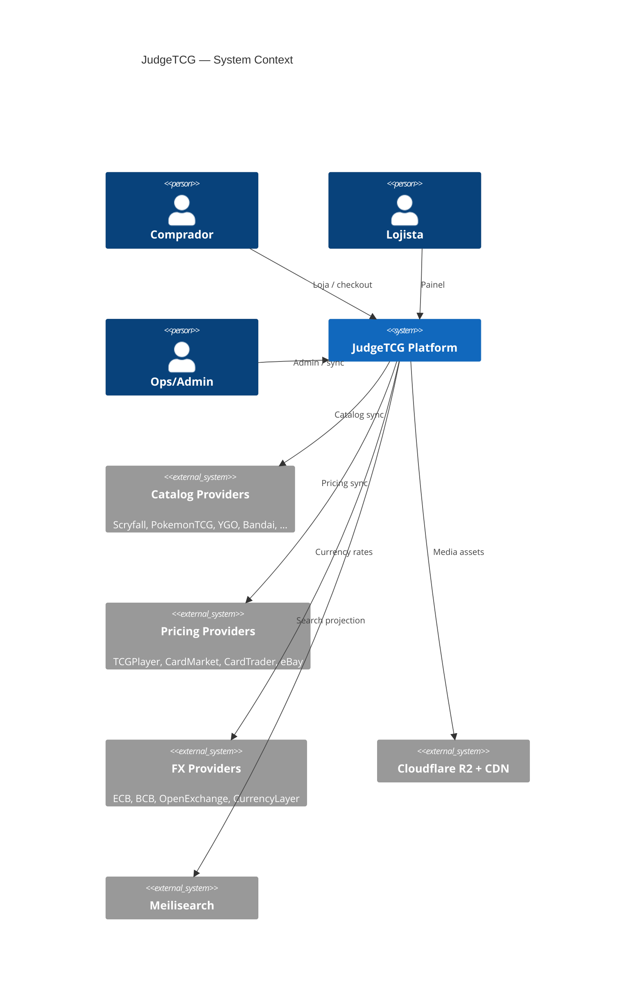
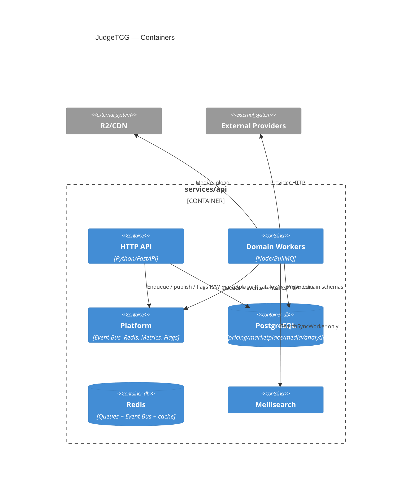
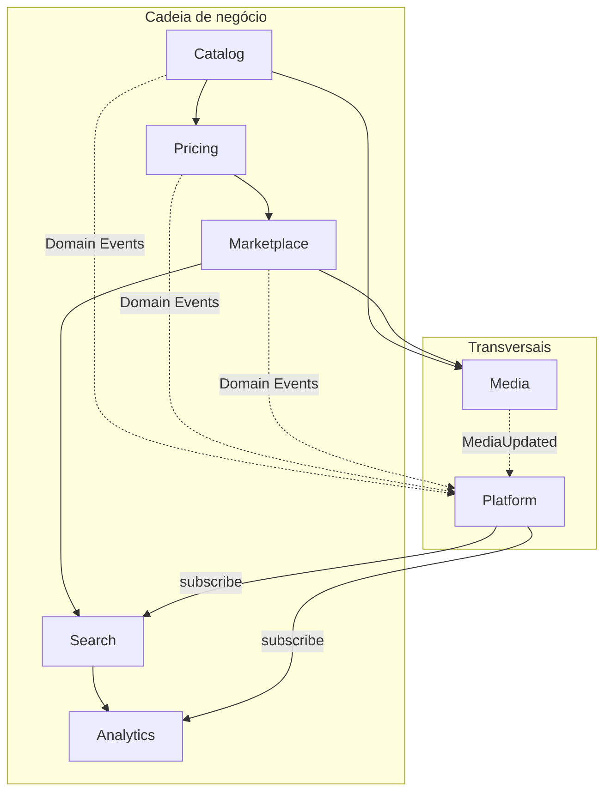
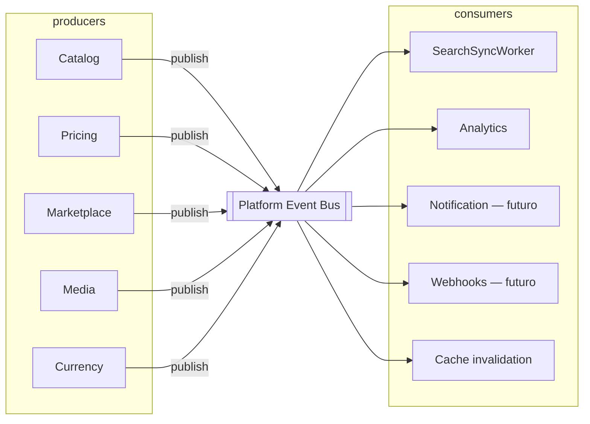

# JudgeTCG — Arquitetura Orientada a Domínios (Revisão Etapa 1.2)

**Status:** Fundação congelada — tag `v0.2.0-foundation` (+ emendas pré-Outbox em FOUNDATION_FREEZE §6)  
**Data:** 2026-07-16  
**Versão:** 1.2.3  
**Escopo:** Catalog → Pricing → Marketplace → Search → Analytics (+ Media + Platform + Audit + Outbox)

> Substitui Etapa 1 (`ingestion-platform`) e Etapa 1.1.  
> Refinamentos 1.2.1 na fundação (§17).  
> Contratos: [`FOUNDATION_FREEZE.md`](./FOUNDATION_FREEZE.md).  
> **Próximo incremento:** Outbox → TransactionManager → Repository interfaces (§18–19).

---

## 1. Princípios

1. **Domain-Oriented Architecture** — um domínio = schema PostgreSQL (quando persistente) = módulo em `services/api/src/`.
2. **Dependência unidirecional** na cadeia de negócio; infraestrutura transversal via Platform.
3. **Adapter Pattern em dois níveis** — interface de domínio + implementação por provider.
4. **Pub/Sub desacoplado** — produtores publicam Domain Events; consumidores se inscrevem sem o produtor conhecê-los.
5. **Monorepo / um backend** — mesma imagem, mesmo pipeline; processos API (uvicorn) e Workers (Node/BullMQ).
6. **Rollout** — OFF → SHADOW → CANARY → LIVE.
7. **Source of Truth explícito** — cada tipo de dado tem uma fonte oficial documentada (§2).

### Cadeia de negócio

```text
Catalog  →  Pricing  →  Marketplace  →  Search  →  Analytics
```

### Domínios transversais

```text
Media      → atende Catalog, Marketplace, Platform (assets de qualquer owner)
Platform   → BullMQ, Redis, Event Bus, Logging, Metrics, Feature Flags, Config, Secrets, Health
```

| Domínio | Escreve | Lê | Não pode |
|---------|---------|-----|----------|
| Catalog | `catalog.*` | providers externos oficiais | preços, Meilisearch, marketplace, mutar media de lojista |
| Media | `media.*` | jobs de download / owners | decidir metadados oficiais da carta |
| Pricing | `pricing.*` | `catalog_card_id`, `variant_id`, `provider_mappings` | nome, texto, imagens, set |
| Marketplace | `marketplace.*` | catalog + pricing (read) + media | sync Scryfall/TCGPlayer |
| Search | índice Meilisearch | Domain Events (vários) | chamar providers |
| Analytics | `analytics.*` | Domain Events + snapshots | mutar catálogo/preços |
| Platform | ops/config/metrics | tudo (infra) | regras de negócio de TCG |

---

## 2. Source of Truth (obrigatório)

Esta decisão evita conflitos quando o lojista tenta “corrigir” dados oficiais.

| Informação | Source of Truth | Pode o lojista sobrescrever? |
|------------|-----------------|------------------------------|
| Nome da carta (oficial) | **Catalog Provider** → `catalog.*` | **Não.** Pode exibir `listing_title` customizado só no anúncio |
| Oracle Text / texto de regras | **Catalog Provider** | Não |
| Legalidade / formatos | **Catalog Provider** | Não |
| Variantes oficiais (foil, promo, idioma de edição) | **Catalog Provider** | Não (escolhe variante existente) |
| Imagem oficial da carta | **Catalog Provider** → espelho via **Media Service** | Não |
| Mapeamentos externos (Scryfall ID, TCGPlayer SKU, …) | **Catalog** (`provider_mappings`) | Não |
| Preços internacionais (min/avg/market) | **Pricing Providers** | Não |
| Cotação FX | **Currency providers** (`currency_rates`) | Não |
| Preço do anúncio BR | **Marketplace** (lojista) | Sim — é o preço de venda |
| Estoque / quantidade | **Marketplace** | Sim |
| Condição (NM/LP/…) do lote à venda | **Marketplace** | Sim |
| Finish escolhido no anúncio | **Marketplace** (referência a `catalog.variants`) | Escolha, não criação arbitrária |
| Fotos do anúncio (usuário) | **Marketplace** → **Media** (`owner_type=listing`) | Sim |
| Logo / banner / avatar de loja | **Marketplace** → **Media** | Sim |
| Selados / boosters / caixas / acessórios (SKU loja) | **Marketplace** (+ Media) | Sim; catálogo oficial de sealed quando existir fica em Catalog |
| Dados do vendedor / KYC | **Marketplace / Identity** | Sim (próprios) |
| Índice de busca | **Search** (projeção; nunca SoT) | N/A — derivado de eventos |
| Trends / rankings | **Analytics** (projeção) | N/A — derivado |

### Regras derivadas

1. Sync de Catalog **sempre vence** campos oficiais; nunca mesclar com edição do lojista.
2. Anúncio pode ter `custom_title` / `seller_notes` / fotos próprias **sem** alterar `catalog.cards`.
3. Media oficial da carta: `owner_type=catalog_card` (ou variant); Media de anúncio: `owner_type=listing`.
4. Se Pricing e Catalog discordarem de um ID externo, `provider_mappings` no Catalog é a ponte; Pricing não inventa carta.
5. Search e Analytics são **read models** — podem atrasar, nunca são fonte.

---

## 3. Um projeto, dois processos

```text
services/api/
  app/          # FastAPI HTTP (legado → bridge)
  src/          # Domínios TS + workers
  Dockerfile    # multi-entrypoint
```

```text
API      → uvicorn app.main:app
Workers  → node dist/workers/main.js
```

Mesmo repositório · mesmo pipeline · mesmas env vars · logs com `requestId`.

---

## 4. Diagramas C4

### 4.1 Context



### 4.2 Container



### 4.3 Domínios



---

## 5. Event Bus — Pub/Sub desacoplado

### Princípio

```text
Domain Event  →  Event Bus  →  N Consumers
```

O produtor **nunca** conhece quem consome. Novos consumidores (Notification, Webhook, Mobile sync, Future Integrations) entram só com subscription.



### Catálogo de eventos (mínimo)

| Evento | Produtor típico |
|--------|-----------------|
| `CardUpdated` | Catalog |
| `SetUpdated` | Catalog |
| `VariantUpdated` | Catalog |
| `ImageUpdated` / `MediaUpdated` | Media |
| `PriceUpdated` | Pricing |
| `CurrencyUpdated` | Pricing/Currency |
| `MarketplaceListingUpdated` | Marketplace |
| `ProviderHealthChanged` | Platform/Registry | 

Payloads carregam IDs e versão (`aggregateId`, `occurredAt`, `requestId`) — não blobs grandes de imagem.

### Search — múltiplos eventos

```text
CardUpdated
PriceUpdated
ImageUpdated / MediaUpdated
SetUpdated
MarketplaceListingUpdated
        ↓
  SearchSyncWorker
        ↓
    Meilisearch
```

O índice é uma **projeção**; nunca Source of Truth.

---

## 6. Domínio Media

### Por que não `catalog_images`

Imagens deixam de ser só carta: logos, banners, avatars, selos, boosters, caixas, decks, acessórios, fotos de anúncio.

### Schema `media.*`

#### `media_assets`

```text
id
type                 -- card_art | listing_photo | store_logo | banner | sealed | booster | accessory | avatar | …
owner_type           -- catalog_card | catalog_variant | listing | store | user | product | …
owner_id             -- UUID do owner
provider             -- scryfall | user_upload | …
original_url         -- nullable (upload direto)
etag
sha256               -- dedup global
mime
filesize
width
height
storage_key          -- R2 key
cdn_url
variants jsonb       -- { "300": "...", "500": "...", "900": "...", "original": "..." }
formats jsonb        -- webp/png keys
created_at
updated_at
UNIQUE(sha256, width, height, mime)  -- ou dedup por sha256 + profile
```

### Fluxo de imagem (obrigatório)

```text
Download / Upload
  ↓
Virus Scan
  ↓
SHA-256
  ↓
Já existe? ──SIM──→ reutilizar storage_key + vincular owner
  ↓ NÃO
Resize (300 / 500 / 900 / original × WEBP / PNG)
  ↓
Upload R2
  ↓
Persist media_assets
  ↓
CDN Invalidation
  ↓
publish MediaUpdated
```

Catalog **enfileira** jobs de mídia; Media Service é o único que fala com R2.

---

## 7. Provider Registry — Capabilities + Health + Statistics

```text
Provider
  ├── Capabilities
  ├── Health
  └── Statistics
```

### Capabilities (descoberta automática)

```json
{
  "cards": true,
  "images": true,
  "variants": true,
  "prices": false,
  "legality": true,
  "rulings": true,
  "languages": true,
  "sealed": false,
  "decks": false,
  "metadata": true
}
```

Catalog providers: `prices` sempre `false`.  
Pricing providers: `cards` tipicamente `false` (só mappings).

### Health

```text
status              -- healthy | degraded | down | unknown
last_success_at
last_error_at
last_error_message
uptime_ratio        -- janela configurável
avg_latency_ms
error_rate
```

### Statistics

```text
requests_today
requests_total
quota_remaining
quota_limit
sync_cards_total
sync_errors_total
```

Atualizado pelos workers após cada chamada; exposto em dashboard Ops.  
Evento `ProviderHealthChanged` quando status muda.

### Rollout

`OFF → SHADOW → CANARY → LIVE` (+ `canaryPercent`).

---

## 8. Contratos Adapter (dois níveis)

### CatalogProvider

```typescript
interface CatalogProvider {
  readonly providerId: string;
  readonly gameCode: string;
  readonly capabilities: ProviderCapabilities;

  syncSets(ctx: SyncContext): Promise<SyncResult>;
  syncCards(ctx: SyncContext, setRef: string): Promise<SyncResult>;
  syncVariants(ctx: SyncContext, cardId: string): Promise<SyncResult>;
  syncImages(ctx: SyncContext, cardId: string): Promise<SyncResult>; // enqueue Media only
  syncLegality(ctx: SyncContext, cardId: string): Promise<SyncResult>;
  syncRulings(ctx: SyncContext, cardId: string): Promise<SyncResult>;
}
```

### PricingProvider

```typescript
interface PriceSyncContext {
  catalogCardId: string;
  variantId?: string;
  providerMappings: ProviderMapping[];
  // PROIBIDO: name, oracleText, imageUrl, setName, artist
}

interface PricingProvider {
  readonly marketId: string;
  syncPrices(ctx: PriceSyncContext): Promise<SyncResult>;
  syncMarket(ctx: PriceSyncContext): Promise<SyncResult>;
  syncHistory(ctx: PriceSyncContext): Promise<SyncResult>;
}
```

### BandaiProvider

HTTP compartilhado; por jogo: `parser`, `endpoints`, `config`, `rateLimits`, `capabilities`.

---

## 9. Estrutura de pastas

```text
services/api/
├── app/                              # FastAPI HTTP
├── src/
│   ├── catalog/
│   │   ├── providers/
│   │   │   ├── interfaces/CatalogProvider.ts
│   │   │   ├── magic/
│   │   │   ├── pokemon/
│   │   │   ├── yugioh/
│   │   │   ├── bandai/
│   │   │   │   ├── BandaiProvider.ts
│   │   │   │   ├── http/
│   │   │   │   └── games/{onepiece,digimon,dragonball,gundam,unionarena,battlespirits}/
│   │   │   ├── lorcana/
│   │   │   ├── starwars/
│   │   │   ├── sorcery/
│   │   │   ├── vanguard/
│   │   │   └── riftbound/
│   │   ├── registry/                 # capabilities + health + statistics + rollout
│   │   ├── services/
│   │   ├── repositories/             # inclui provider_mappings
│   │   ├── mappers/
│   │   ├── parsers/
│   │   ├── dto/
│   │   └── config/
│   ├── pricing/
│   │   ├── providers/{tcgplayer,cardmarket,cardtrader,ebay}/
│   │   ├── currency/
│   │   ├── services/
│   │   └── repositories/             # price_snapshots, price_history, currency_rates
│   ├── media/
│   │   ├── ImageService.ts
│   │   ├── VirusScan.ts
│   │   ├── DedupStore.ts
│   │   ├── R2Storage.ts
│   │   └── repositories/
│   ├── marketplace/                  # bridge / fronteira
│   ├── search/
│   │   └── SearchSyncWorker.ts
│   ├── analytics/
│   │   ├── repositories/
│   │   └── consumers/
│   ├── platform/                     # Infrastructure operacional
│   │   ├── bullmq/
│   │   ├── redis/
│   │   ├── event-bus/
│   │   ├── logging/
│   │   ├── metrics/
│   │   ├── feature-flags/
│   │   ├── config/
│   │   ├── secrets/
│   │   └── health/
│   ├── shared/                       # tipos/DTOs/erros de domínio compartilhados
│   ├── core/                         # utilitários puros (sem I/O operacional)
│   └── workers/
│       ├── main.ts
│       ├── catalog/
│       ├── pricing/
│       ├── media/
│       ├── currency/
│       └── search/
├── package.json
└── Dockerfile*
```

**Nomenclatura:**  
- `platform/` = infraestrutura operacional (BullMQ, Event Bus, métricas, flags).  
- `shared/` / `core/` = tipos e helpers de domínio sem side-effects de infra.

---

## 10. BullMQ — filas

```text
Catalog Sync (orchestrator)
  → catalog.sets
  → catalog.cards
  → catalog.variants
  → media.process          # (ex-catalog.images)
  → catalog.legality
  → catalog.rulings

pricing.prices | pricing.market | pricing.history
currency.rates
search.sync
analytics.ingest
```

Cada fila: retry exponencial 3–5 · `*.dlq` · logs `requestId|jobId|providerId|gameCode` · métricas Prometheus (`sync_duration_seconds`, `sync_cards_total`, `sync_errors_total`, `queue_depth`).

---

## 11. Modelo PostgreSQL

### `catalog.*`

| Tabela | Notas |
|--------|-------|
| `catalog_games` | |
| `catalog_sets` | |
| `catalog_cards` | Sem preço; sem blob de imagem |
| `catalog_card_faces` | |
| `catalog_variants` | |
| `catalog_legality` | |
| `catalog_rulings` | |
| `catalog_languages` | |
| **`provider_mappings`** | (ex-catalog_providers) |
| `catalog_artists` | |
| `catalog_traits` | |
| `catalog_keywords` | |
| `catalog_relationships` | |

#### `provider_mappings`

```text
id
provider
provider_card_id
provider_set_id
provider_variant_id
catalog_card_id
catalog_variant_id nullable
metadata jsonb
UNIQUE(provider, provider_card_id, provider_variant_id)
```

Semântica: **mapeamento carta ↔ provider**, não a entidade Provider em si (registry fica em Platform/Catalog registry tables).

### `media.*`

`media_assets` (§6)

### `pricing.*`

| Nome | Antes | Notas |
|------|-------|-------|
| `pricing_markets` | — | |
| **`current_price_snapshot`** | (emenda) | Snapshot quente — leitura de vitrine |
| **`price_history`** | pricing_history | Append-only |
| `currencies` | — | USD/EUR/JPY |
| **`currency_rates`** | exchange_rates | + `exchange_provider` |

> Nota 1.2.3: `price_snapshots` da migration Fase 1 será evoluída para `current_price_snapshot` + `price_history` (sync: insert history → upsert current). Não usar overwrite único.

#### `current_price_snapshot` / campos TCGPlayer-ready

```text
catalog_card_id, variant_id, market_id
min_price, avg_price, market_price, max_price?
currency, condition, printing, language, finish
seller_count, last_sale, last_sale_date
recorded_at
UNIQUE parcial / natural key por dimensão de mercado
```

#### `currency_rates`

```text
base, quote, rate, as_of
exchange_provider   -- ECB | BCB | OpenExchange | CurrencyLayer
```

### `marketplace.*` / `judge.*` / `analytics.*`

Como na 1.1; analytics: `daily_prices`, `market_trends`, `most_searched`, `most_viewed`, `price_variation`, `sales_rank`.

### Bridge legado

Views `tcg_judge.card_catalog` / `card_prices` → `catalog.*` / `pricing.price_snapshots` até cutover.

---

## 12. Matriz de capacidades (resumo)

| Provider | cards | images | variants | prices* | legality | rulings | languages | sealed | decks |
|----------|:-----:|:------:|:--------:|:-------:|:--------:|:-------:|:---------:|:------:|:-----:|
| Scryfall | ✓ | ✓ | ✓ | ✗† | ✓ | ✓ | ✓ | △ | △ |
| PokemonTCG.io | ✓ | ✓ | ✓ | ✗† | △ | ✗ | ✓ | △ | ✗ |
| YGOPRODeck | ✓ | ✓ | △ | ✗† | △ | ✗ | △ | ✗ | ✗ |
| Bandai family | ✓ | ✓ | △ | ✗ | ✗ | ✗ | △ | △ | ✗ |
| LorcanaJSON | ✓ | ✓ | △ | ✗ | △ | ✗ | △ | ✗ | ✗ |
| SWU DB | ✓ | ✓ | △ | ✗ | △ | ✗ | △ | ✗ | ✗ |
| Curiosa | ✓ | ✓ | △ | ✗ | ✗ | ✗ | △ | ✗ | ✗ |
| Bushiroad VG | ✓ | ✓ | △ | ✗ | ✗ | ✗ | △ | ✗ | ✗ |
| Riftbound stub | △ | △ | △ | ✗ | ✗ | ✗ | ✗ | ✗ | ✗ |
| TCGPlayer | ✗‡ | △ | △ | ✓ | ✗ | ✗ | ✓ | ✓ | ✗ |
| CardMarket | ✗‡ | △ | △ | ✓ | ✗ | ✗ | ✓ | ✓ | ✗ |
| CardTrader | ✗‡ | △ | △ | ✓ | ✗ | ✗ | ✓ | ✓ | ✗ |
| eBay | ✗ | ✗ | ✗ | ✓ | ✗ | ✗ | ✗ | △ | ✗ |

† Preço Scryfall/etc. só via Pricing adapter + `provider_mappings`, nunca no CatalogProvider.  
‡ Pricing resolve IDs via mappings.

---

## 13. Fluxos resumidos

### Catalog sync

Registry (mode+capabilities+health) → Sets → Cards → Variants → Media enqueue → Legality → Rulings → publish events.

### Pricing

Lê `provider_mappings` → PricingProvider → `price_snapshots` / `price_history` → `PriceUpdated`.

### Search

Subscribe a vários eventos → projeta Meilisearch.

### Analytics

Subscribe → preenche marts (stubs na Fase 1–6).

---

## 14. Plano de migração (atualizado)

| Fase | Conteúdo |
|------|----------|
| 0 | Remover preço do upsert Python; unificar cron preços |
| 1 | `src/` + Platform + Event Bus + schemas catalog/pricing/media + Scryfall + Media skeleton + workers |
| 2 | Demais CatalogProviders (SHADOW→CANARY→LIVE) |
| 3 | Media full (virus scan, dedup, R2, CDN) |
| 4 | PricingProviders + currency multi-provider |
| 5 | SearchSyncWorker multi-evento; desligar index inline |
| 6 | Analytics schema + consumers |
| 7 | Desligar `tcg_adapters` legado; SoT enforce na API |

---

## 15. Avaliação crítica (1.2)

### Benefícios dos refinamentos
- Media como serviço transversal evita explodir `catalog_images`
- Pub/Sub real permite Notification/Webhook sem tocar Catalog
- Health/Statistics no registry viram dashboard Ops
- SoT documentado evita guerra lojista vs Scryfall
- Nomenclatura (`provider_mappings`, `price_snapshots`, `currency_rates`) alinha semântica

### Riscos
| Risco | Mitigação |
|-------|-----------|
| Domínio Media a mais | Fronteira clara owner_type; Catalog só enfileira |
| Event Bus genérico demais | Schema versionado de eventos; dead-letter de consumers |
| Híbrido Python/Node | Mesmo package; health por processo |
| Lojista tenta editar nome oficial | API rejeita; só `listing_title` |

### Simplificação
- Não criar segundo serviço Render
- Analytics sem regras no início
- Virus scan pluggable (interface + no-op em dev)

---

## 16. Checklist de aprovação Etapa 2

- [x] Domínio **Media** (`media.*` / `media_assets`) — em vez de `catalog_images`
- [x] Event Bus **pub/sub** desacoplado (produtor não conhece consumidores)
- [x] Provider Registry com **Capabilities + Health + Statistics**
- [x] **Source of Truth** documentado (§2)
- [x] Search multi-evento
- [x] Nomenclatura: `provider_mappings`, `price_snapshots`, `price_history`, `currency_rates`
- [x] Domínio **Platform** (infra operacional)
- [x] Confirmação explícita do produto: lojista **não** edita nome/oracle/imagem oficial (só listing overlay) — alinhado à recomendação §2
- [x] Refinamentos 1.2.1 (§17) — event versioning, pHash, audit, analytics_events, queue priority, flags, cost, IndexProjectionVersion

---

## 17. Refinamentos 1.2.1 (incorporados na Fase 1)

| # | Refinamento | Decisão |
|---|-------------|---------|
| 1 | Event envelope versionado | `{ event, version, aggregateId, occurredAt, requestId, payload }` |
| 2 | `provider_mappings.provider_object_type` | `CARD \| SET \| VARIANT \| SEALED \| DECK \| TOKEN` |
| 3 | Media `perceptual_hash` | Além de SHA-256 (idêntico) → pHash (quase-duplicata) |
| 4 | Search `IndexProjectionVersion` | Índices `cards_v1`, `cards_v2` — rebuild sem downtime |
| 5 | Analytics pipeline | `analytics_events` → aggregators → marts (`daily_prices`, …) |
| 6 | Marketplace render | Catalog + Overlay → **Rendered Card** (só no read model/FE; nunca grava Catalog) |
| 7 | Provider **Cost** | `requests`, `credits`, `estimated_cost`, `daily_cost` no Registry |
| 8 | BullMQ priority | `HIGH \| NORMAL \| LOW` (ex.: price HIGH, image LOW) |
| 9 | Feature flags | `feature_flags` / `provider_flags` / `game_flags` (ex.: `enable_rulings=false`) |
| 10 | Schema **`audit.*`** | `audit_events`, `entity_changes`, `sync_runs`, `job_executions` |

### Marketplace — Rendered Card (read model)

```text
Catalog (SoT oficial)
    +
Overlay do anúncio (título, fotos seller, preço, estoque)
    ↓
Rendered Card  ← montado na API/FE; NUNCA escrito de volta no Catalog
```

---

## Histórico

| Versão | Mudança |
|--------|---------|
| 1.0 | `ingestion-platform` + schema `ingestion` (rejeitado) |
| 1.1 | Monorepo, schemas por domínio, Event Bus básico, Search, Canary |
| 1.2 | Media, Platform, SoT, Registry Health, pub/sub pleno, nomenclatura, Search multi-evento |
| 1.2.1 | Event versioning, provider_object_type, pHash, IndexProjectionVersion, analytics_events, Cost, queue priority, flags, audit.*, Rendered Card |
| 1.2.2 | Foundation freeze + tag `v0.2.0-foundation`; Outbox Pattern documentado; contratos públicos congelados |
| 1.2.3 | Emendas pré-Outbox: consumer_offsets, envelope triplo (type/event/schema), TransactionManager antes de repos, current_price_snapshot, índices mappings, projection_version, registry cost/availability |

---

## 18. Outbox + Transaction + Repositories (ordem canônica)

### 18.1 Runtime

```text
Request
  → TransactionManager.begin()
  → Repositories (upserts)
  → OutboxRepository.insert (mesma TX)
  → COMMIT
  → Outbox Publisher
  → Redis Event Bus
  → Consumers (+ consumer_offsets)
```

**Proibido:** publish antes do commit (eventos fantasma).

### 18.2 Ordem de construção

```text
1 Outbox
2 TransactionManager
3 Repository interfaces + Postgres* implementations
4 BullMQ processors
5 Persistência real
6–8 Scryfall OFF → SHADOW → CANARY → LIVE
9+ Demais providers → Media → Pricing → Search → Analytics
```

### 18.3 Envelope

`eventType` + `eventVersion` + `schemaVersion` + `projectionVersion?` + `requestId` / `traceId`.

Detalhes de tabelas: [`FOUNDATION_FREEZE.md`](./FOUNDATION_FREEZE.md) §3–6.

---

## 19. Repository Pattern

```text
CatalogRepository (port)
  └── PostgresCatalogRepository (adapter)
```

Services de domínio nunca dependem de Supabase/SDK vendor.

Índices obrigatórios em `provider_mappings`:  
`(provider, provider_card_id)`, `(provider, provider_variant_id)`, `(catalog_card_id)`, `(catalog_variant_id)`.

---

**Próximo incremento após autorização:** Outbox (schema + publisher idempotente) — sem Scryfall write.
