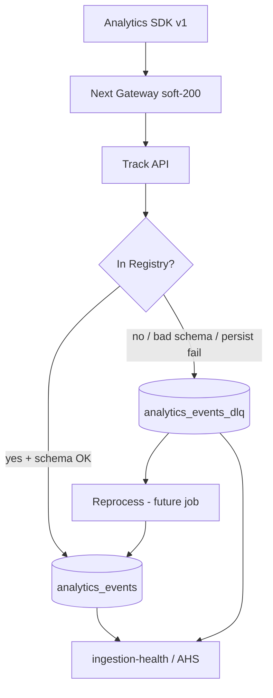

# Event Platform Architecture — Beta 1.5

**Version:** 1.0.0  
**Status:** Implemented (ingest integrity layer)  
**Owner:** Platform

---

## Mission

Transform analytics into **mission-critical infrastructure**: every emitted event is validated, versioned, persisted or dead-lettered, audited, traced, and recoverable — **never silently discarded**.

---

## Components

| Component | Location |
|-----------|----------|
| Registry | `app/judge/event_registry.py` + EVENT_REGISTRY.md |
| Ingest | `app/judge/analytics_events.py` |
| API | `POST /runtime/judge/analytics/track` |
| Health | `GET /runtime/judge/analytics/ingestion-health` |
| Gateway | `frontend/.../api/analytics/track/route.ts` |
| SDK | `frontend/.../lib/analytics.ts` |
| DLQ table | `tcg_judge.analytics_events_dlq` |
| Migration | `20260714120000_beta15_event_integrity.sql` |

---

## Guarantees (Beta 1.5)

1. **Parity:** FE surface ⊆ registry.  
2. **No silent drop:** unknown → DLQ.  
3. **Versioned envelope:** `event_schema_version`.  
4. **Traceability:** `ingest_trace_id` per batch.  
5. **Idempotency path:** keys + unique index (after migration).  
6. **Truthful client clear:** queue cleared only when `ok` and lost=0.  
7. **Backward compatible:** soft HTTP 200; old clients; default v1; legacy insert if columns missing.

---

## Non-goals (this sprint)

Dashboards UI, heatmaps, replay product, A/B engine, marketplace/checkout rule changes.
