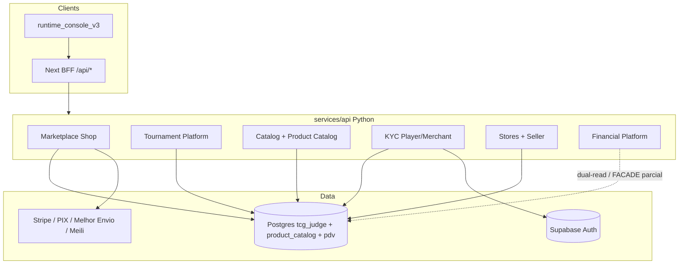
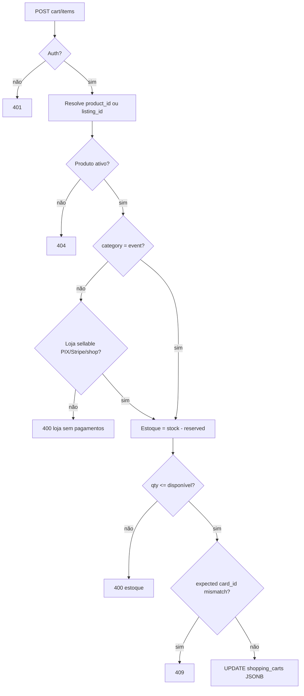
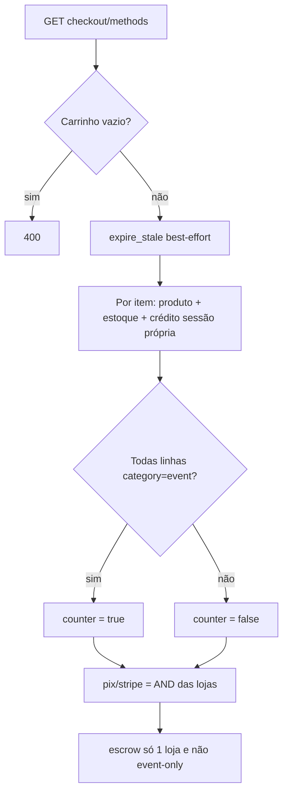
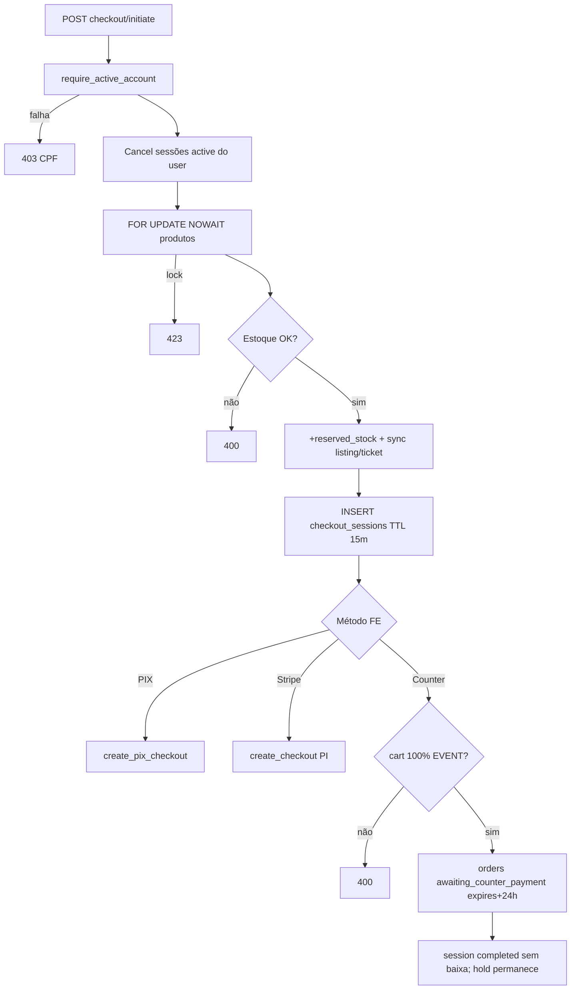
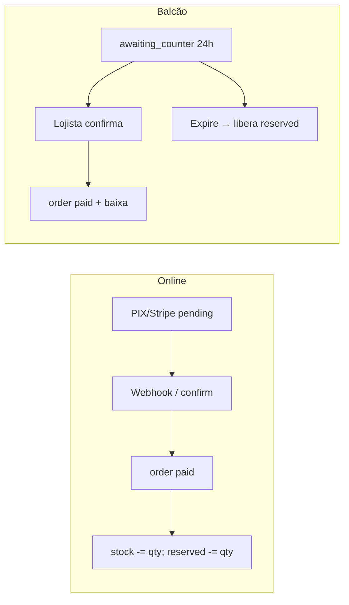
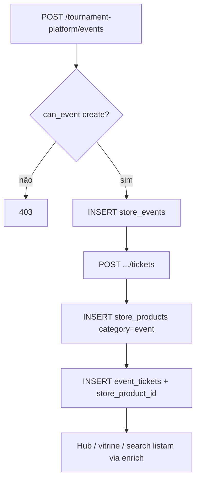
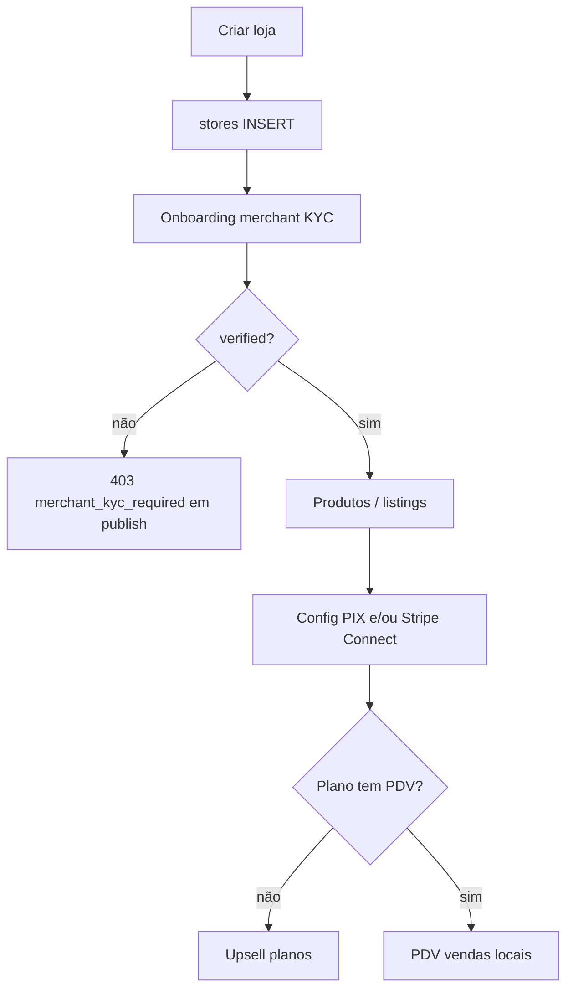
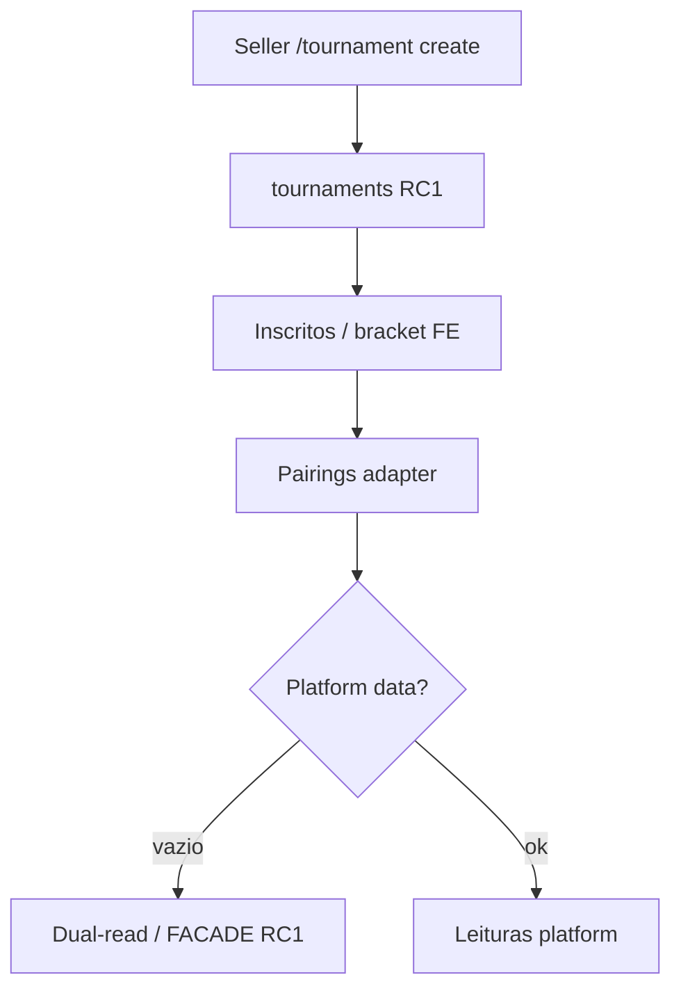
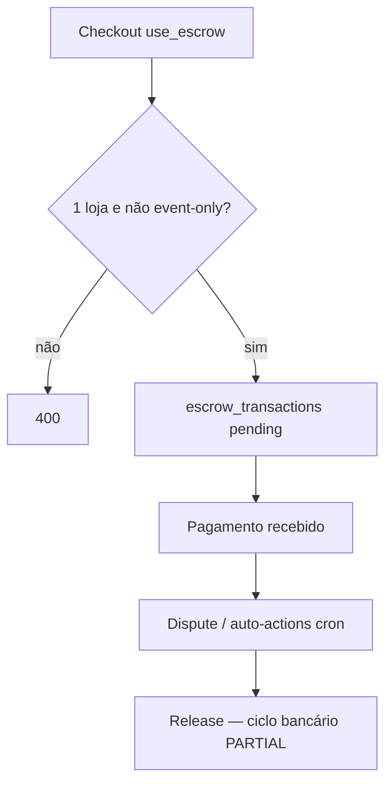

# JudgeTCG — Especificação Funcional da Plataforma

> **Status:** documento vivo, evidência de código (ago/2026).  
> **Hierarquia:** Platform Constitution → ADRs → North Star → este doc → código.  
> **Não substitui** ADRs nem North Star. Métricas de maturidade/ops aqui **não** são North Star.

## 1. Objetivo e escopo

Este documento descreve a **funcionalidade operacional** da superfície canônica (`frontend/runtime_console_v3` + `services/api` Python + Postgres `tcg_judge` / schemas satélite), com:

- fluxogramas (condicionais + erros + validações);
- pontos de integração com banco classificados como **FULL | PARTIAL | FACADE**;
- contratos de API relevantes.

**Fora do escopo deste mapa como “produto canônico”:**

- `apps/web` cart/checkout TS (legado / stub de pagamento);
- superfícies dual-read Financial Platform que só espelham shop;
- seeds/simulation em Beta (proibido pela Constituição).

### Legenda de completeness (DB)

| Grau | Significado |
|------|-------------|
| **FULL** | SQL real, tabelas/migrations, fluxo ponta-a-ponta no código canônico |
| **PARTIAL** | Tabelas/API existem; lacunas de ciclo (UI, gateway, release, sync) |
| **FACADE** | Adapter / dual-read / stub / placeholder sem mutação completa do domínio |

---

## 2. Mapa da plataforma (visão geral)



### Domínios e completeness

| Domínio | Completeness | Evidência principal |
|---------|--------------|---------------------|
| Auth Supabase + sessão FE | **FULL** | `entrar`, cookies/JWT → `X-Judge-User-Id` |
| KYC CPF (gate compra) | **FULL** | `kyc_api`, `player_profiles`, `require_active_account` |
| Merchant KYC / Stripe Connect | **FULL** | `shop_connect`, `merchant_profiles` |
| Carrinho + checkout atômico 15m | **FULL** | `shop_cart`, `checkout_atomic` |
| PIX / Stripe pedidos | **FULL** (gateway Asaas **PARTIAL**) | `shop_pix`, `shop_checkout`, `shop_orders` |
| Counter EVENT 24h | **FULL** | `shop_counter`, migration `20260809200000_*` |
| Store Events / Ingressos | **FULL** | `tournament_platform` + espelho `store_products` |
| RC1 Tournament engine | **PARTIAL** / pairings **FACADE** | `/tournament`, `/vendedor/painel/torneios` |
| Catalog singles search | **FULL** | `catalog/search_service` |
| Product catalog selados | **PARTIAL** | schema + search; cobertura por jogo varia |
| PDV | **FULL** (plano Pro+) | `shop_pdv`, `pdv.local_products` |
| Escrow shop | **PARTIAL** | `shop_escrow` — create/confirm; release bancário menos maduro |
| Financial Platform | **FACADE** / paralelo | `financial_platform`, dual-read |

---

## 3. Identidade, sessão e KYC

### 3.1 Fluxo autenticado

```mermaid
flowchart TD
  A[Usuário acessa rota protegida] --> B{Sessão Supabase?}
  B -->|não| C[Redirect /entrar?next=...]
  B -->|sim| D[BFF injeta X-Judge-User-Id]
  D --> E{Endpoint exige account active?}
  E -->|não| F[Continua]
  E -->|sim| G{account_status = active?}
  G -->|não / sem CPF| H[403 cpf_required / modal completar-perfil]
  G -->|sim| F
  C --> I{Login OK?}
  I -->|erro| J[UI erro auth]
  I -->|ok| K[GET /account/status]
  K --> L{CPF completo?}
  L -->|não| M[/completar-perfil]
  L -->|sim| N[Home / next]
```

### 3.2 Validação CPF (API)

| Regra | Erro |
|-------|------|
| CPF com dígitos inválidos / sequência | `400 cpf_invalid` |
| Lookup externo falhou (se configurado) | `400 cpf_lookup_failed` |
| `cpf_hash` já existe | `409 cpf_already_registered` |
| Sem auth | `401` |

**DB FULL:** `tcg_judge.player_profiles`, `tcg_judge.kyc_audit_logs`.

---

## 4. Marketplace — carrinho e checkout

### 4.1 Contratos HTTP (canônicos)

| Método | Path | Função |
|--------|------|--------|
| GET/POST/PUT/DELETE | `/runtime/judge/marketplace/shop/cart*` | Carrinho |
| GET | `.../checkout/methods` | Métodos elegíveis |
| POST | `/runtime/judge/checkout/initiate` | Reserva 15 min |
| POST | `.../checkout` | Stripe |
| POST | `.../checkout/pix` | PIX |
| POST | `.../checkout/counter` | Balcão EVENT 24h |
| POST | `.../orders/{id}/confirm-counter` | Lojista confirma |
| POST | `/runtime/judge/checkout/expire-stale` | Expire sessões + counters |

FE: `/carrinho`, `/checkout` → BFF `/api/marketplace/shop/*`, `/api/checkout/*`.

### 4.2 Add to cart



**DB FULL:** `shopping_carts`, `store_products`, `stores`, `card_listings`.

### 4.3 Métodos de pagamento



### 4.4 Initiate (hold 15 min) → ramos de pagamento



### 4.5 Confirmação / erros de pagamento

| Path | Sucesso | Erros típicos | DB |
|------|---------|---------------|-----|
| PIX | order `pending` → webhook → `paid` + baixa estoque | 400 PIX/cupom; 401 webhook; 410 tx | FULL |
| Stripe | PI + webhook `payment_intent.succeeded` | 503 sem key; 400 loja; 409 IntegrityError | FULL |
| Counter confirm | `paid` + `apply_sale_stock_deduction` | 403 owner; 400 status | FULL |
| Expire 15m | `expire_checkout_sessions()` libera reserved | — | FULL |
| Expire 24h counter | `expire_counter_orders()` → `expired` | — | FULL |



---

## 5. Eventos / Ingressos (store events)

### 5.1 Superfície de produto

| Rota FE | Função |
|---------|--------|
| `/search/torneios` | Lista pública Eventos (todos jogos allowlist ADR-016) |
| `/search/torneios/[id]` | Detalhe + add-to-cart |
| `/torneio`, `/torneio/[id]` | Redirect permanente → search |
| `/vendedor/painel/ingressos` | CRUD + pedidos balcão |
| `/stores/[slug]` | Vitrine “Garantir vaga” |

**RC1 separado (não misturar):** `/tournament/[id]`, `/vendedor/painel/torneios` (Swiss/bracket).

### 5.2 Seller cria evento + ticket



**Validações ticket:** `price_cents >= 0`; policy BP2 permite PIX/Stripe/counter.  
**Erros:** `event_not_found`, `ticket_not_found`, `price_cents_invalid`, `policy_errors`, `forbidden_event_*`.

**DB FULL:** `store_events`, `event_tickets`, `store_products` (category `event`).  
**PARTIAL:** `event_registrations` / check-in existem na API mas CTA público usa shop cart, não obriga registration.

### 5.3 Compra de ingresso

```mermaid
flowchart TD
  A[Detalhe evento] --> B{registration_open e vagas e store_product_id?}
  B -->|não| C[CTA disabled]
  B -->|sim| D{Auth?}
  D -->|não| E[/entrar]
  D -->|sim| F[POST cart product_id]
  F --> G[Checkout]
  G --> H{Pagar no site?}
  H -->|PIX/Stripe| I[Fluxo online 15m]
  H -->|Balcão| J[Hold 24h]
  J --> K[Seller Confirmar pagamento]
```

---

## 6. Vendedor — loja, produtos, pagamentos, PDV



| Capacidade | Completeness | Notas |
|------------|--------------|-------|
| CRUD loja / slug | FULL | `stores` |
| Produtos shop | FULL | exige merchant verified |
| PIX settings | FULL | Manual/OpenPix; Asaas stub |
| Stripe Connect | FULL | onboarding + charges/payouts |
| PDV | FULL | gate plano; preço do DB |
| Cupons / CRM | PARTIAL→FULL por endpoint | ver `shop_coupons`, `shop_crm` |

---

## 7. Catálogo e descoberta

```mermaid
flowchart TD
  A[/loja/busca] --> B[BFF catalog/cards/search]
  B --> C{Meili disponível?}
  C -->|sim| D[Search Meili + hydrate PG]
  C -->|não| E[Search PG]
  D --> F[Facetas + preços marketplace]
  E --> F
  G[/loja/selados] --> H[product-catalog search]
  H --> I{schema product_catalog?}
  I -->|não| J[503 unavailable]
  I -->|sim| K[Variants + media links]
```

| Superfície | Completeness |
|------------|--------------|
| Singles search/detail | **FULL** |
| Sets / game portals | **FULL** (cobertura por jogo varia) |
| Selados master | **PARTIAL** |
| Intelligence / top movers | **PARTIAL** (marts + cache) |

---

## 8. Torneios RC1 (engine)



| Capacidade | Completeness |
|------------|--------------|
| CRUD torneio seller | PARTIAL/FULL operacional RC1 |
| Pairings / standings platform | **FACADE** adapters |
| Link `store_event` ↔ tournament | PARTIAL (bridge opcional) |

---

## 9. Financeiro e escrow



| Camada | Completeness |
|--------|--------------|
| Shop escrow create/confirm/dispute | **PARTIAL** |
| Financial Platform journals/payouts UI | **FACADE** / paralelo |

---

## 10. Matriz de erros HTTP (padrão plataforma)

| Código | Uso típico |
|--------|------------|
| 400 | Validação de negócio (estoque, método, policy, CPF inválido) |
| 401 | Sem `X-Judge-User-Id` / sessão |
| 403 | Permissão loja/evento; CPF obrigatório; KYC merchant |
| 404 | Recurso inexistente (ou privado mascarado) |
| 409 | Conflito (CPF duplicado, card mismatch, IntegrityError) |
| 410 | PIX/tx expirado |
| 423 | Lock estoque concurrent |
| 503 | Dependência down (Stripe key, product_catalog schema) |

Auth seller/eventos: Identity permissions `store.events.*` / ownership `stores.owner_id`.

---

## 11. Tabelas DB — integração FULL (núcleo comercial)

| Tabela | Domínios |
|--------|----------|
| `player_profiles` | KYC, buyer |
| `stores` | Seller, checkout methods |
| `store_products` | Shop + ingressos EVENT |
| `card_listings` | Singles marketplace |
| `shopping_carts` | Carrinho |
| `checkout_sessions` | Hold 15m |
| `shop_orders` / `shop_order_items` | Pedidos (pix/stripe/counter/escrow_*) |
| `shop_order_status_history` | Auditoria status |
| `pix_transactions` | PIX |
| `store_events` / `event_tickets` | Ingressos |
| `merchant_profiles` | KYC lojista |
| Funções SQL `expire_checkout_sessions`, `expire_counter_orders` | TTL |

Schemas satélite: `product_catalog.*` (**PARTIAL** cobertura), `pdv.*` (**FULL** sob plano), `media.*` (assets).

---

## 12. Cron / jobs operacionais

| Job | Função |
|-----|--------|
| `expire-checkouts` workflow / `POST .../expire-stale` | Libera holds 15m + counters 24h |
| Escrow auto-actions | FE cron proxy → shop escrow |
| Catalog sync workflows | Providers → PG |
| Vercel Deploy Hook | FE após quality gate |
| Render Deploy Hook | API em push `services/api/**` |

---

## 13. Especificação funcional por persona (resumo)

### Comprador
1. Busca carta/produto → oferta → add cart (auth) → CPF se necessário → checkout PIX/Stripe → pedido em `/perfil/pedidos`.
2. Evento → add ingresso → site ou balcão 24h → loja confirma (balcão).

### Lojista
1. Onboarding loja + KYC + PIX/Stripe → publicar produtos → pedidos/envio.
2. Aba Ingressos → publicar evento → receber counter orders → confirmar.
3. PDV (plano) → venda local.
4. Torneios RC1 (painel separado) → inscritos/bracket.

### Juiz / ops (platform)
- Dashboards tournament-platform / judge health — leituras + writes staff/penalties **PARTIAL** em UI.

---

## 14. Critérios de “pronto para Beta” (observado × Constitution)

| Critério | Estado observado |
|----------|------------------|
| Checkout shop com hold atômico | Operacional (FULL DB) |
| Eventos públicos + counter 24h | Operacional (FULL DB) |
| North Star LPC/LCS | Ainda 0 (Evidence/Market Learning) |
| Seeds em Beta | Proibido — não usar |
| SWU no produto | Hard-exit ADR-016 |

---

## 15. Manutenção deste documento

1. Qualquer fluxo **FULL** novo exige migration + rota API + BFF + teste mínimo.
2. Não promover FACADE a FULL sem evidência SQL + path de erro.
3. Atualizar a matriz da §2 quando mudar completeness.
4. ADRs vencem este texto em conflito.

---

*Gerado a partir de inspeção de `services/api/app/{marketplace,tournament_platform,kyc,catalog,stores}` e `frontend/runtime_console_v3` — ago/2026.*
