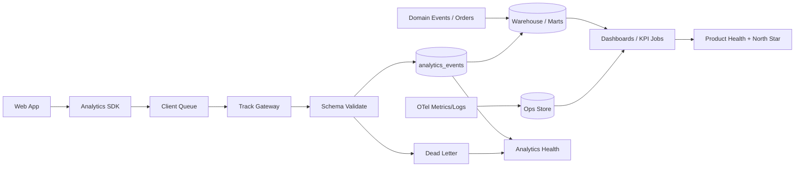

# Product Analytics Architecture

**Version:** 1.1.0  
**Status:** Active — Event Integrity layer (Beta 1.5) implemented  
**Owner:** Product Analytics + Platform  
**See also:** [EVENT_PLATFORM_ARCHITECTURE.md](./EVENT_PLATFORM_ARCHITECTURE.md)

---

## 1. Goals

- Answer product questions automatically with **trusted** event data.  
- Separate product analytics from platform OTel while correlating via `session_id` / `ingest_trace_id`.  
- Money/orders from domain tables; intent/UX from events.

---

## 2. As-is (Beta 1.5)

```text
Browser trackEvent (schema v1 + idempotency_key)
        → localStorage queue
        → POST /api/analytics/track (soft HTTP 200, body.ok truthful)
        → API record_analytics_events (EVENT_REGISTRY)
        → analytics_events  OR  analytics_events_dlq
        → ingestion-health / Analytics Health Score
```

**Guarantee:** no silent allowlist discard. Unknown/invalid → DLQ + audit fields.

---

## 3. Target warehouse path



### Principles

1. Measure-first / registry-gated.  
2. Dual source of truth (domain + events).  
3. Allowlist + dead-letter — never silent drop.  
4. Versioned schemas (`event_schema_version`).  
5. PII minimization.  
6. Idempotent conversions.

---

## 4. Layers

| Layer | Responsibility |
|-------|----------------|
| Collection | SDK + page_view |
| Transport | Queue + keepalive flush |
| Ingest | Registry + schema + DLQ |
| Storage | Raw + DLQ |
| Semantics | Funnels/KPIs docs |
| Activation | Dashboards/alerts |
| Governance | Registry CI parity |

---

## 5. Immediate ops checklist

1. Apply migration `20260714120000_beta15_event_integrity.sql`.  
2. Watch `GET /runtime/judge/analytics/ingestion-health`.  
3. Keep AHS ≥ 75 before trusting event-only KPIs.
